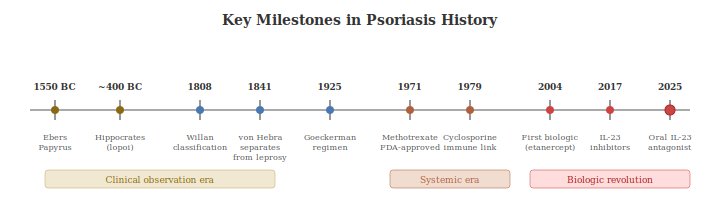

## 2.1 Ancient and Biblical Origins

Psoriasis is one of the oldest recognised skin diseases, but for most of recorded history nobody distinguished it from other scaly or disfiguring conditions, most notably leprosy (Hansen's disease). The Hebrew Bible describes a condition called *tzaraat* (צָרַעַת), which caused people to be declared ritually unclean and banished from their communities (Leviticus 13–14). Scholars now believe that many cases of *tzaraat* were likely psoriasis rather than true leprosy, meaning people with psoriasis may have been among the first patients subjected to medical exile. The stigma was profound: affected individuals were forced to live outside the camp, wear torn clothes, and cry "unclean, unclean" to warn others.

Ancient Egyptian medical texts (the Ebers Papyrus, c. 1550 BC) describe treatments for scaly skin conditions using mixtures including cat faeces, which represents one of the earliest recorded topical therapies [(Brajac & Gruber, 2012)](https://doi.org/10.5772/27640). Hippocrates (460–377 BC) used the Greek term *lopoi* (scaly conditions) to describe what may have included psoriasis, and reportedly advocated plant-derived tar and pitch preparations to treat skin conditions. That principle would eventually evolve, through the development of coal tar in the industrial era, into modern phototherapy thousands of years later. Galen (129–c. 200 AD) used the term *psoriasis*, derived from the Greek *psora* (to itch), but confusingly applied it to a condition of the eyelids and scrotum that was likely seborrhoeic dermatitis rather than what we now call psoriasis [(Brajac & Gruber, 2012)](https://doi.org/10.5772/27640).

## 2.2 The Leprosy Confusion (200 AD – 1800)

For over 1,500 years following Galen, psoriasis and leprosy remained entangled in medical and public consciousness. During medieval Europe, both conditions were grouped under the Latin term *lepra*, and people with either disease faced similar social exclusion. They were forced into leprosariums and sometimes required to carry a bell or clapper to announce their presence. This confusion persisted even as knowledge of other diseases advanced. Treatments during this era were rudimentary and often dangerous: mercury ointments, arsenic compounds, viper broth, bloodletting, and purgatives were all applied without clear distinction between conditions.

## 2.3 The Birth of Dermatology (1800–1900)

The separation of psoriasis from leprosy is one of the great diagnostic achievements of 19th-century medicine. In 1808, English physician Robert Willan (1757–1812), widely regarded as the founder of dermatology as a medical speciality, published the first volume of his systematic classification of skin diseases, *On Cutaneous Diseases* [(Willan, 1808)](https://archive.org/details/2577014R.nlm.nih.gov). He provided the first clear clinical description of psoriasis, identifying guttate, scalp, and palmar variants, and noted that lesions typically begin on the elbows and knees. He used the term *lepra vulgaris*, though, unfortunately perpetuating the association with leprosy.

The decisive break came from Austrian dermatologist Ferdinand von Hebra (1816–1880), who in 1841 formally separated psoriasis from leprosy by eliminating the term *lepra* from descriptions of psoriatic lesions and restoring the name *psoriasis* [(Holubar, 2003)](https://doi.org/10.1046/j.1468-3083.2003.00622.x). Von Hebra's work, including his landmark *Atlas der Hautkrankeiten* (Atlas of Skin Diseases), used clinical observation and early microscopy to establish psoriasis as a distinct entity.

Other 19th-century milestones followed. In 1860, Ernest Bazin connected psoriasis to joint disease ("arthritic psoriasis"), foreshadowing the modern understanding of psoriatic arthritis [(Brajac & Gruber, 2012)](https://doi.org/10.5772/27640). In 1872, Heinrich Köbner described the phenomenon of new psoriatic lesions appearing at sites of skin trauma, now known as the Köbner phenomenon and still used as a diagnostic indicator [(Boyd & Neldner, 1990)](https://pubmed.ncbi.nlm.nih.gov/2204607/). In 1870, Heinrich Auspitz described the pinpoint bleeding when psoriatic scale is removed (the Auspitz sign) [(Auspitz, 1870)](https://doi.org/10.1007/BF01822714). And in 1898, William Munro described the characteristic neutrophil micro-abscesses in the epidermis that pathologists still look for today [(Brajac & Gruber, 2012)](https://doi.org/10.5772/27640).

## 2.4 The Twentieth Century: From Skin Disease to Immune Disease

The 20th century saw two transformative shifts in understanding. The first was therapeutic: Goeckerman introduced his combination of coal tar and ultraviolet light therapy in 1925 [(Goeckerman, 1925; Dennis et al., 2013)](https://pmc.ncbi.nlm.nih.gov/articles/PMC3735239/), and Ingram added anthralin application to this regimen in 1953 [(Ingram, 1953)](https://doi.org/10.1136/bmj.2.4836.591). These approaches remained mainstays of treatment for decades. Methotrexate, originally developed as a cancer chemotherapy agent, was discovered to improve psoriasis in the 1950s when patients receiving it for other conditions saw their skin clear [(Edmundson & Guy, 1958)](https://pubmed.ncbi.nlm.nih.gov/13558707/). It received formal indication for psoriasis in 1972 [(Brajac & Gruber, 2012)](https://doi.org/10.5772/27640) and remains widely used today.

The second shift was conceptual. Throughout the early 20th century, psoriasis was understood as a disorder of keratinocyte hyperproliferation: the skin cells were simply growing too fast. Nobody considered the immune system central. This changed dramatically in the 1970s–1990s through several serendipitous observations. The discovery that cyclosporine, an immunosuppressant drug developed for organ transplant patients, potently cleared psoriasis was pivotal [(Mueller & Herrmann, 1979)](https://pubmed.ncbi.nlm.nih.gov/460314/). The logic was simple: if suppressing the immune system cured the skin disease, then the immune system must be driving it. Bone marrow transplant studies confirmed this. Transplant from a psoriasis patient to a non-psoriatic recipient could transfer the disease, and conversely, transplant from a non-psoriatic donor to a psoriasis patient could cure it [(Eedy et al., 1990)](https://doi.org/10.1136/bmj.300.6729.908).

## 2.5 The Biologic Revolution (2003–Present)

The identification of TNF-α as a key cytokine in psoriasis led to the first biologic therapy approvals: etanercept (2004) and adalimumab (2008) for psoriasis, following earlier success in rheumatoid arthritis [(Armstrong & Read, 2020)](https://pubmed.ncbi.nlm.nih.gov/32427307/). For the first time, some patients experienced complete skin clearance. The subsequent discovery of the IL-23/IL-17 axis in the mid-2000s refined understanding further and led to a succession of increasingly targeted drugs: ustekinumab (2009, targeting IL-12/23), secukinumab (2015, targeting IL-17A), and risankizumab (2019, targeting IL-23 specifically). Each generation improved efficacy, with modern IL-23 inhibitors achieving PASI 100 (complete clearance) in 40–55% of patients [(Sbidian et al., 2023)](https://www.cochranelibrary.com/cdsr/doi/10.1002/14651858.CD011535.pub6/full). Earlier generations of dermatologists would have found that result unbelievable.

The journey from biblical exile to molecular medicine spans over 3,000 years. It's a story of incremental observation punctuated by revolutionary insights, and a reminder that the stigma associated with visible skin disease has a very long shadow.
