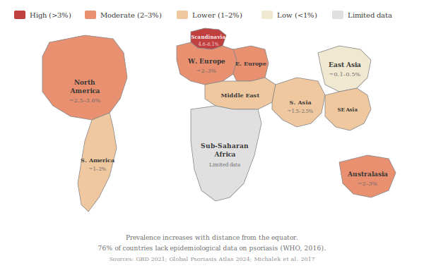

## 3.1 Global Prevalence

Psoriasis affects approximately 2–3% of the global population, though prevalence varies considerably by geography, ethnicity, and age. The commonly cited figure of "125 million people worldwide" — originating from the International Federation of Psoriasis Associations and the WHO's 2016 Global Report on Psoriasis — represents an estimate based on applying regional prevalence rates to global population figures, and likely reflects lifetime or period prevalence. The more recent Global Burden of Disease (GBD) 2021 study, which uses a standardised methodology to measure point prevalence (the number of people living with active disease at a given time), estimated approximately 42.98 million prevalent cases and 5.10 million new cases of psoriasis worldwide in 2021, with the global burden having nearly doubled since 1990 [(Xiong et al., 2025)](https://pmc.ncbi.nlm.nih.gov/articles/PMC12283580/). The difference between these figures reflects methodological differences in how prevalence is defined and measured rather than a true discrepancy.

The Global Psoriasis Atlas 2024 update estimated the crude lifetime prevalence for adults in high-income countries at 1.40%, with wide geographic variation [(Dimmock, Aalemi et al., 2024)](https://academic.oup.com/bjd/article/191/Supplement_3/ljae360.061/7916197). A systematic review of worldwide epidemiology found adult prevalence ranged from 0.51% to 11.43% across different populations, and from 0% to 1.37% in children [(Michalek et al., 2017)](https://pubmed.ncbi.nlm.nih.gov/27573025/).

## 3.2 Geographic Variation

Psoriasis prevalence is notably higher in regions further from the equator. Norway has one of the highest recorded prevalence rates at approximately 4.6%, with even higher rates (6.1%) in its northern regions — possibly due to reduced sunlight exposure and lower vitamin D levels [(Dairov et al., 2024)](https://www.clinmedkaz.org/download/prevalence-incidence-gender-and-age-distribution-and-economic-burden-of-psoriasis-worldwide-and-in-14497.pdf). The United Kingdom reports a prevalence of approximately 2.8% [(Parisi et al., 2013)](https://pubmed.ncbi.nlm.nih.gov/23014338/). In contrast, psoriasis is relatively rare in certain East Asian and African populations [(Parisi et al., 2013)](https://pubmed.ncbi.nlm.nih.gov/23014338/).

## 3.3 Age and Gender

Psoriasis can present at any age, but incidence peaks bimodally: in early adulthood (ages 15–30) and again in later life (ages 50–60). These two peaks correspond to what is sometimes classified as **Type 1 psoriasis** (early onset, typically before age 40, strongly associated with HLA-C*06:02 and family history) and **Type 2 psoriasis** (late onset, after age 40, weaker genetic association) [(Capon, 2020)](https://pmc.ncbi.nlm.nih.gov/articles/PMC9128944/). The overall disease burden is slightly higher in men, though certain regions show higher female prevalence, particularly in East and South Asia [(Xiong et al., 2025)](https://pmc.ncbi.nlm.nih.gov/articles/PMC12283580/).
