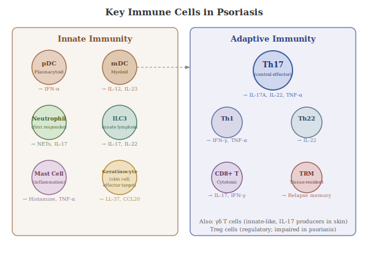

To understand psoriasis at a molecular level, you need some fundamental immunology vocabulary. This section defines the key terms used throughout the book.

## 4.1 Innate vs. Adaptive Immunity

The immune system has two broad branches:

- **Innate immunity** is the body's first line of defence. It responds rapidly and non-specifically to threats. Innate immune cells include **neutrophils** (the most abundant white blood cells, which engulf and destroy pathogens), **macrophages** (cells that engulf debris and pathogens, and also present fragments of them to other immune cells), and **dendritic cells** (sentinel cells that detect threats and relay information to the adaptive immune system). Physical barriers like the skin itself also count as innate immunity.

- **Adaptive immunity** is slower but highly specific. It's carried out primarily by **T cells** and **B cells**, white blood cells that can recognise very specific molecular targets called **antigens** (any substance the immune system can recognise and respond to, such as a piece of a virus or bacterium). Adaptive immunity has memory: once it encounters a pathogen, it mounts a faster, stronger response upon re-exposure. This is the principle behind vaccination.

## 4.2 Key Cell Types

- **T cells** (or T lymphocytes): A major class of adaptive immune cells that mature in the thymus gland. There are many subtypes, including:
  - **T helper (Th) cells** (also called CD4+ T cells): These don't directly kill threats. Instead, they coordinate the immune response by releasing signalling molecules called cytokines (see Section 4.3). Different subsets of Th cells produce different cytokine profiles. Think of them as specialist teams, each sending different instructions:
    - **Th1 cells** produce interferon-gamma (IFN-γ) and tumour necrosis factor alpha (TNF-α), promoting inflammation and activating macrophages.
    - **Th17 cells** produce interleukin-17 (IL-17), IL-22, and TNF-α. They are critical in psoriasis.
    - **Th22 cells** produce IL-22, which drives skin cell proliferation.
    - **Regulatory T cells (Tregs)** suppress excessive immune responses and maintain immune tolerance, the ability to avoid attacking the body's own tissues. When Tregs don't function properly, the immune system can turn against the body (as happens in psoriasis).
  - **Cytotoxic T cells** (CD8+ T cells): These directly kill infected or abnormal cells.
- **Dendritic cells (DCs)**: Antigen-presenting cells that act as messengers between innate and adaptive immunity. They detect threats and show fragments of them to T cells, essentially saying "this is what we need to fight." Two key subtypes:
  - **Plasmacytoid dendritic cells (pDCs)**: Specialise in producing type I interferons (such as IFN-α), potent antiviral alarm signals. In psoriasis, pDCs are the cells that first sound the immune alarm.
  - **Myeloid dendritic cells (mDCs)**: The primary producers of IL-12 and IL-23 in the skin. These instruct T cells to differentiate into specific subtypes.
- **Keratinocytes**: The predominant cell type in the epidermis (outer layer of skin). Although not classically considered immune cells, keratinocytes play an active immunological role: they produce antimicrobial peptides, cytokines, and chemokines, and are key effector cells in psoriasis.
- **Neutrophils**: Innate immune cells that are among the first responders to sites of infection or injury. In psoriasis, they accumulate in characteristic micro-abscesses within the epidermis.

## 4.3 Key Signalling Molecules

- **Cytokines**: Small proteins released by cells that act as chemical messengers to regulate immune responses. Think of them as text messages that cells send to each other, telling nearby cells to ramp up inflammation, calm down, multiply, or come to a specific location. The word "interleukin" (abbreviated IL) simply means "between white blood cells" and names a large family of cytokines. When you see "IL-" followed by a number (e.g. IL-17, IL-23), it's just a specific cytokine in this family. Key psoriasis-related cytokines include:
  - **TNF-α (Tumour Necrosis Factor alpha)**: A major pro-inflammatory cytokine involved in many inflammatory diseases, including psoriasis. It amplifies the immune response and was the first cytokine successfully targeted by psoriasis drugs.
  - **IL-17 (Interleukin-17)**: A cytokine family produced primarily by Th17 cells. IL-17A is the most important member in psoriasis. It tells keratinocytes to multiply rapidly and produce their own inflammatory mediators, making it the key "effector" molecule that directly causes psoriatic skin changes.
  - **IL-23 (Interleukin-23)**: Produced by dendritic cells and macrophages. IL-23 is essential for creating and sustaining Th17 cells; without it, Th17 cells can't survive and multiply. This makes IL-23 the "upstream master switch" of the psoriasis inflammatory cascade. IL-23 is composed of two protein subunits: p19 (unique to IL-23) and p40 (shared with another cytokine, IL-12). This structural detail matters because some drugs block only IL-23, while an older drug (ustekinumab) blocks both IL-23 and IL-12 by targeting the shared p40 piece.
  - **IL-22 (Interleukin-22)**: Drives keratinocyte proliferation and inhibits their normal differentiation, contributing to the thickened epidermis seen in psoriatic plaques.
  - **IFN-γ (Interferon gamma)**: Produced by Th1 cells and natural killer cells. Activates macrophages and enhances antigen presentation.
  - **IFN-α (Interferon alpha)**: Produced by plasmacytoid dendritic cells. Important in the initiation phase of psoriasis.
- **Chemokines**: A subset of cytokines whose specific job is to attract immune cells to particular locations, essentially "come here" signals (the name comes from "chemo-" meaning chemical + "-kine" meaning movement). For example, **CCL20** attracts Th17 cells to the skin, which is why it plays such a critical role in the psoriasis feedback loop.
- **Antimicrobial peptides (AMPs)**: Small protein fragments produced by keratinocytes that serve a dual role: they kill bacteria and other microbes on the skin's surface, but they also act as alarm signals to the immune system. **LL-37** (also known as cathelicidin) is a key AMP in psoriasis. It's the molecule that accidentally triggers the immune cascade by binding to the body's own DNA, creating complexes that immune cells mistake for a foreign threat.

## 4.4 The HLA System

The **Human Leukocyte Antigen (HLA)** system is a group of genes on chromosome 6 that encode proteins on the surface of your cells. These proteins, called **Major Histocompatibility Complex (MHC)** molecules, present fragments of proteins (peptides) to T cells, enabling the immune system to distinguish "self" from "non-self." Think of MHC molecules as display shelves on the surface of every cell: they hold up samples of whatever is inside the cell for passing T cells to inspect. If a T cell spots something foreign on the shelf, it triggers an immune response. There are two main classes: MHC class I (found on nearly all cells, showing T cells what's happening inside the cell) and MHC class II (found mainly on specialised immune cells, showing T cells what threats have been found in the environment). Variations in HLA genes profoundly influence susceptibility to autoimmune and inflammatory diseases, including psoriasis, because different HLA variants present different peptides. Some variants may accidentally present the body's own proteins in a way that triggers an immune attack.
