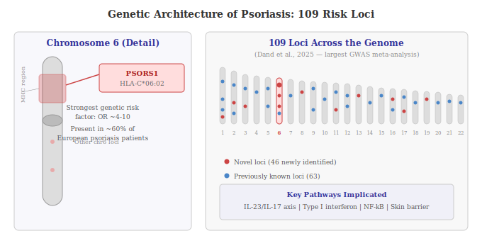

## 5.1 Heritability

Psoriasis has a strong genetic component. More than 20% of patients report a family history of the disease, and concordance (the likelihood that both twins have the disease) is significantly higher in monozygotic (identical) twins than dizygotic (fraternal) twins. Overall heritability is estimated at approximately 66% [(Dand et al., 2025)](https://www.nature.com/articles/s41467-025-56719-8). But psoriasis is a polygenic disease: no single gene is sufficient to cause it. Instead, it arises from the cumulative effects of many genetic variants, each contributing a small increase in risk, interacting with environmental factors.

## 5.2 The PSORS1 Locus and HLA-C*06:02

The strongest genetic risk factor for psoriasis is the **HLA-C*06:02** allele (a specific variant of a gene; humans carry two copies of most genes, and an "allele" is one particular version), located within the **PSORS1** (Psoriasis Susceptibility 1) locus on chromosome 6p21. This region lies within the MHC class I interval. HLA-C encodes a protein that presents peptide fragments to CD8+ T cells, enabling immune surveillance.

Carrying one copy of HLA-C*06:02 increases psoriasis risk by approximately 206%, and the allele accounts for the single largest genetic effect in the disease [(Chen et al., 2011)](https://doi.org/10.1371/journal.pone.0019454). That said, HLA-C*06:02 only explains approximately 6.7% of the total genetic heritability of psoriasis, indicating that many other genes contribute to disease risk [(Chen et al., 2011)](https://doi.org/10.1371/journal.pone.0019454).

The PSORS1 locus has the largest effect size and accounts for 35–50% of disease heritability explained by known loci [(Capon, 2020)](https://www.medicaljournals.se/acta/content/html/10.2340/00015555-3384). HLA-C*06:02 is strongly associated with Type 1 (early-onset) psoriasis and is validated as the primary susceptibility allele in both European and East Asian populations, though it has a very low allele frequency in Japanese populations, where other HLA alleles such as HLA-A*02:07 predominate [(Li et al., 2019)](https://academic.oup.com/pcm/article/2/2/120/5522496).

## 5.3 Beyond PSORS1: The Broader Genetic Landscape

Genome-wide association studies (GWAS) scan the entire genome of thousands of people to find genetic variants associated with a disease. A 2025 meta-analysis of 18 GWAS comprising 36,466 cases and 458,078 controls identified 109 distinct susceptibility loci, including 46 not previously reported [(Dand et al., 2025)](https://www.nature.com/articles/s41467-025-56719-8). These loci implicate several key biological pathways:

- **The IL-23/IL-17 signalling axis**: Variants in genes encoding IL-23 receptor (IL23R), IL-12B (shared p40 subunit of IL-12 and IL-23), IL-23A (p19 subunit of IL-23), and IL-17RA have been identified. This provides genetic evidence for the central role of this pathway in psoriasis and validates the targets of current biologic therapies.
- **NF-κB signalling**: NF-κB is a transcription factor that controls the expression of many pro-inflammatory genes. Variants in TNFAIP3, TNIP1, CARD14, and REL, all involved in NF-κB regulation, are associated with psoriasis risk.
- **Type I interferon signalling**: Variants in genes involved in interferon production and response, including IFIH1 and TYK2.
- **Skin barrier function**: Deletions in the late cornified envelope genes LCE3B and LCE3C, which encode proteins involved in the terminal differentiation of the skin's outermost layer, are associated with psoriasis susceptibility [(Riveira-Munoz et al., 2011; cited in El-Boghdady et al., 2023)](https://pmc.ncbi.nlm.nih.gov/articles/PMC10418823/).
- **Antigen processing**: The interaction between HLA-C and **ERAP1** (Endoplasmic Reticulum Aminopeptidase 1), an enzyme that trims proteins into the right size for display on MHC class I molecules, provides evidence that the way cells present internal protein fragments to the immune system may go wrong in psoriasis, causing T cells to attack skin cells [(Strange et al., 2010)](https://pmc.ncbi.nlm.nih.gov/articles/PMC3749730/).

## 5.4 Pharmacogenomics (Using Genetics to Guide Treatment)

Genetic information is beginning to inform treatment decisions. Patients positive for HLA-C*06:02 respond better to the IL-12/23 inhibitor ustekinumab than HLA-C*06:02-negative patients, particularly during the initial months of treatment [(Capon, 2020)](https://www.medicaljournals.se/acta/content/html/10.2340/00015555-3384). A risk score of 200 genetic markers has shown promise in predicting the development of psoriatic arthritis in patients with skin psoriasis [(Capon, 2020)](https://www.medicaljournals.se/acta/content/html/10.2340/00015555-3384).
