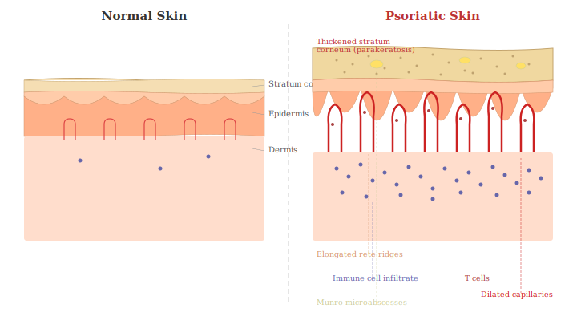
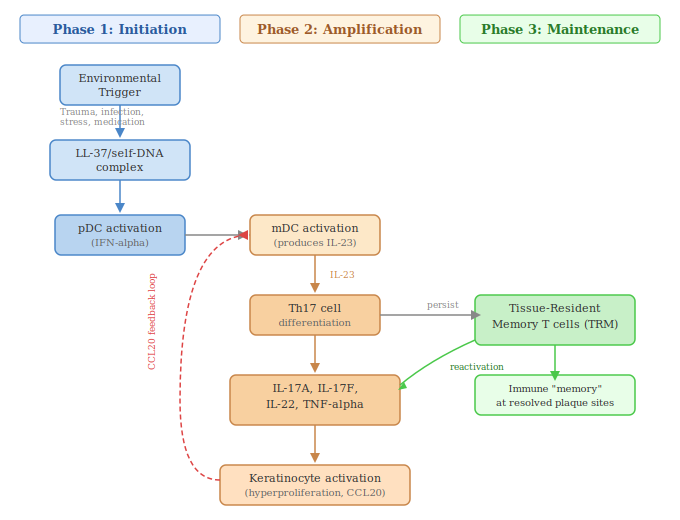
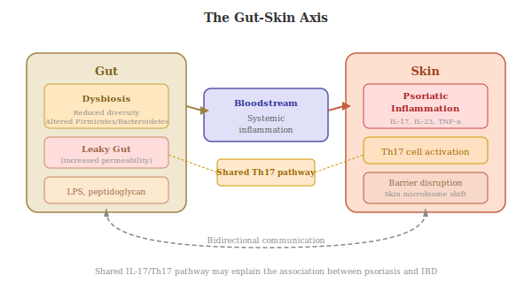

The pathogenesis of psoriasis involves a complex interplay between innate and adaptive immune cells, keratinocytes, and a network of cytokines. The current model can be understood in three overlapping phases: initiation, amplification, and chronic maintenance.

> **Visual companion:** An interactive illustrated guide to the mechanisms below — including skin cross-section diagrams, the inflammatory cascade, and the self-amplifying feedback loop — is provided in the accompanying file [visual-guide.html](/visual-guide.html).

## 6.0 The Everyday Analogy

Before diving into molecular detail, here is a simplified analogy that captures the essence of psoriasis pathogenesis:

> **The Factory Analogy:** Think of your skin as a conveyor belt in a factory. Normally, new tiles (skin cells) are placed on the belt at one end and gently fall off the other end at a steady pace — about one full cycle every 28 days. In psoriasis, someone has cranked the belt speed to 10x. Tiles pile up at the end because they can't fall off fast enough. Meanwhile, an overzealous security team (the immune system) keeps sounding false alarms, calling in more and more workers — making everything worse. The result: a chaotic pile-up that's red, raised, and inflamed. Biologic drugs work by silencing specific members of that security team.

## 6.1 The Pathogenic Triad

Emerging evidence identifies three cell types as constituting a central "pathogenic triad" in psoriasis: **dendritic cells**, **Th17 cells**, and **keratinocytes** [(Sieminska et al., 2024)](https://pmc.ncbi.nlm.nih.gov/articles/PMC11193704/).

- Dendritic cells produce TNF-α and IL-23, promoting T cell differentiation toward Th17 cells.
- Th17 cells produce the key psoriatic cytokines IL-17, IL-22, and TNF-α.
- Keratinocytes respond to these cytokines by proliferating excessively and producing their own inflammatory mediators, including chemokines that recruit more immune cells, creating a self-sustaining cycle.

## 6.2 Phase 1: Initiation

In genetically predisposed individuals, a trigger event — such as physical trauma to the skin (the **Koebner phenomenon**), streptococcal infection, stress, or certain medications — sets off the initial immune cascade [(Griffiths et al., 2021)](https://www.thelancet.com/journals/lancet/article/PIIS0140-6736(20)32549-6/abstract).

In the early phase, damaged or stressed keratinocytes release self-DNA and the antimicrobial peptide **LL-37**. LL-37 binds to self-DNA, forming complexes that are normally ignored by the immune system. However, in psoriasis-susceptible individuals, these LL-37–DNA complexes activate **plasmacytoid dendritic cells (pDCs)** via Toll-like receptors (TLR7 and TLR9) — pattern-recognition sensors on immune cells that detect molecular signatures typically associated with viruses or bacteria. This activation stimulates pDCs to produce large quantities of **type I interferons (IFN-α)** — powerful alarm signals that put the broader immune system on high alert [(Armstrong & Read, 2020)](https://pubmed.ncbi.nlm.nih.gov/32427307/).

Simultaneously, **neutrophils** infiltrate the skin early in the process, releasing neutrophil extracellular traps (NETs — web-like structures made of DNA that neutrophils expel to trap pathogens), exosomes (tiny parcels of signalling molecules), matrix metalloproteinase 9 (MMP9 — an enzyme that breaks down tissue to allow immune cells to move through it), and IL-17 [(Sieminska et al., 2024)](https://pmc.ncbi.nlm.nih.gov/articles/PMC11193704/).

> **The False Fire Alarm:** Imagine LL-37/DNA complexes as burnt toast smoke. In most people, the smoke detector (pDC) briefly beeps and resets. In someone with psoriasis-susceptibility genes, the smoke detector is hypersensitive — it triggers the full building fire alarm (IFN-α), calling every fire engine in town.

## 6.3 Phase 2: Amplification — The IL-23/Th17 Axis

IFN-α produced by pDCs activates **myeloid dendritic cells (mDCs)**, which then produce two critical cytokines: **IL-12** and **IL-23**.

- **IL-12** drives the differentiation of naïve T cells into **Th1 cells**, which produce IFN-γ and TNF-α.
- **IL-23** is central to the survival and proliferation of **Th17 cells** and **Th22 cells**.

Th17 cells are now recognised as the dominant pathogenic T cell subset in psoriasis. They produce:
- **IL-17A**: The most important effector cytokine in psoriasis. IL-17A acts directly on keratinocytes, inducing them to produce a broad array of pro-inflammatory chemokines (CCL20, CXCL1, CXCL8), antimicrobial peptides (LL-37, β-defensins), and cytokines, while simultaneously promoting keratinocyte hyperproliferation.
- **IL-22**: Promotes epidermal thickening (acanthosis) by stimulating keratinocyte proliferation and inhibiting normal differentiation.
- **TNF-α**: Amplifies inflammation by synergising with IL-17A.

This creates a **self-amplifying "feed-forward" inflammatory loop**: IL-17 stimulates keratinocytes to produce CCL20, which attracts more CCR6-expressing Th17 cells to the skin; these Th17 cells produce more IL-17, and the cycle continues and escalates [(Hawkes et al., 2017)](https://www.jacionline.org/article/S0091-6749(17)31197-1/fulltext).

> **The Chain Reaction:** IL-23 is like a drill sergeant turning recruits (naïve T cells) into a specialised assault force (Th17 cells). Those soldiers produce IL-17A — which is like a megaphone that tells the factory workers (keratinocytes) to speed up production AND to broadcast recruitment ads for more soldiers. Each new soldier brings another megaphone. This is why the response escalates so quickly.

## 6.4 Phase 3: Chronic Maintenance and Immunological Memory

In established psoriatic plaques, the inflammatory response becomes self-sustaining. The continuous cross-talk between immune cells and keratinocytes maintains the characteristic features of psoriasis: epidermal hyperproliferation (skin cells dividing far too rapidly), aberrant differentiation (skin cells failing to mature properly), new blood vessel formation (angiogenesis — the growth of new blood vessels, which deliver more immune cells and nutrients to sustain the plaque), and persistent immune cell infiltration.

A critical concept in understanding psoriasis chronicity is the role of **tissue-resident memory T cells (TRM cells)**. These are a subset of T cells that persist in previously affected skin long after plaques have clinically resolved. IL-17A-producing CD8+ TRM cells are associated with early relapse of psoriasis after therapy is discontinued [(Sieminska et al., 2024)](https://pmc.ncbi.nlm.nih.gov/articles/PMC11193704/). Additionally, IL-17-producing γδ (gamma-delta) T cells — a specialised and relatively rare subset of T cells that are particularly common in barrier tissues like the skin, where they act as early sentinels — have been shown to persist in previously psoriatic skin and establish a memory population capable of reinitiating disease [(Sieminska et al., 2024)](https://pmc.ncbi.nlm.nih.gov/articles/PMC11193704/).

This immunological memory helps explain why psoriasis tends to recur in the same locations and why complete, durable remission is difficult to achieve.

> **The Immune System's "Sticky Note":** TRM cells are like sticky notes left on the inside of your skin that say "there was a problem here." Even after treatment clears a plaque, the notes remain. Any small provocation causes the immune system to read the note and restart the entire inflammatory programme — which is why psoriasis keeps coming back to the same spots.

## 6.5 Other Cells and Pathways

While the DC–Th17–keratinocyte triad is the core of the current pathogenic model, numerous other cells and signalling pathways contribute:

- **Th9 cells** and **Th22 cells** contribute additional cytokines to the inflammatory milieu.
- **Innate lymphoid cells (ILCs)**, particularly group 3 ILCs, are an innate source of IL-17 and IL-22 in psoriatic skin.
- **Mast cells** are increased in psoriatic lesions and may contribute to both inflammation and angiogenesis.
- **The NF-κB pathway**: A key intracellular signalling cascade that controls the expression of many pro-inflammatory genes in both immune cells and keratinocytes [(Gopika et al., 2024)](https://www.sciencedirect.com/science/article/abs/pii/S0024320524005812).
- **The JAK-STAT pathway**: An intracellular signalling relay system that operates inside cells, downstream of many cytokine receptors. When a cytokine (like IL-23) lands on a cell's surface receptor, JAK enzymes (Janus kinases) inside the cell activate STAT proteins, which then travel to the cell's nucleus to switch specific genes on or off. This pathway is a key mechanism through which cytokines exert their effects, and it is the target of newer "small molecule" drugs [(Gopika et al., 2024)](https://www.sciencedirect.com/science/article/abs/pii/S0024320524005812).

- **The gut-skin axis**: The gut microbiome (the trillions of bacteria living in the intestines) is increasingly recognised as playing a role in psoriasis. Patients with psoriasis show altered gut microbiota composition — a state called dysbiosis (an unhealthy imbalance of gut bacteria) — and increased gut barrier permeability (a "leaky gut"), which may allow bacterial products to escape into the bloodstream and fuel systemic inflammation [(Al-Kufi et al., 2025)](https://pmc.ncbi.nlm.nih.gov/articles/PMC12047224/).

## 6.6 The Gut-Skin Axis: Deeper Mechanisms

The gut-skin axis is a dynamic, bidirectional communication system in which gut-derived metabolites, immune signals, and microbial products directly influence cutaneous immune responses — and vice versa [(Zhu et al., 2025)](https://www.frontiersin.org/journals/microbiology/articles/10.3389/fmicb.2025.1711288/full).

**Bacterial signatures.** Psoriatic gut dysbiosis is characterised by decreased **Faecalibacterium prausnitzii** (a butyrate-producing bacterium with anti-inflammatory properties) and increased **Prevotella copri** (associated with Th17-mediated inflammation). These changes are consistent across multiple cohort studies and mirror the dysbiosis seen in other IL-17-driven diseases such as rheumatoid arthritis.

**Metabolite-mediated epigenetic reprogramming.** A 2025 study in *Gut Microbes* demonstrated a remarkable mechanism: indole-producing gut bacteria promote the accumulation of **indole-3-sulfate**, which activates the aryl hydrocarbon receptor (AhR) on skin-homing Th17 cells, directly remodelling their epigenetic state and amplifying IL-17 production. This provides a concrete molecular link between gut bacterial metabolism and skin inflammation [(Liu et al., 2025)](https://www.tandfonline.com/doi/full/10.1080/19490976.2025.2473524).

**Short-chain fatty acids (SCFAs).** Microbial fermentation of dietary fibre produces SCFAs (acetate, propionate, butyrate), which modulate psoriasis severity through multiple pathways: suppression of Th17 differentiation, promotion of regulatory T cell (Treg) development, maintenance of intestinal barrier integrity, and signalling through the gut-brain axis. Reduced SCFA-producing bacteria in psoriatic patients may contribute to both skin inflammation and the psychiatric comorbidities discussed in Section 16.

**The skin microbiome.** The skin itself harbours a distinct microbiome that is altered in psoriasis. A 2024 study published in the *Journal of Clinical Investigation* found a relative and absolute increase in **Malassezia** species (a genus of fungi) on psoriatic lesions compared with non-lesional and healthy skin. Notably, IL-23 inhibitor treatment significantly reduced Malassezia percentage in the skin mycobiome, suggesting that immune-mediated shifts in the skin microbial community are reversible with targeted therapy [(Fyhrquist et al., 2024)](https://www.jci.org/articles/view/184315).

No consistent psoriasis-specific skin microbiome "signature" has been identified, reflecting the complexity of microbial communities and the influence of body site, treatment, and individual variation.

**Research stage: Emerging.** **Evidence strength: Moderate.** Supported by multiple human cohort studies, animal models, and mechanistic metabolite studies. No microbiome-targeted therapy has demonstrated clinical efficacy in psoriasis RCTs.
