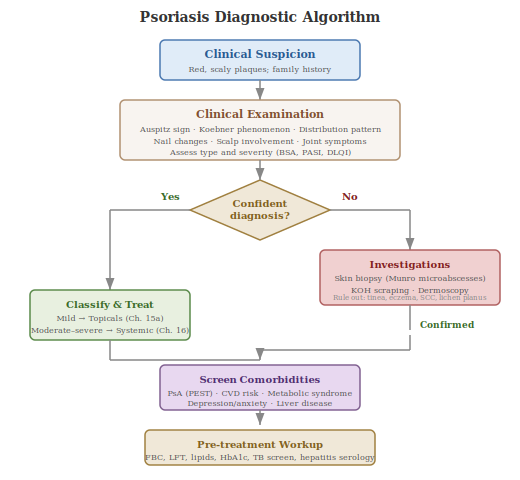

Psoriasis is primarily a clinical diagnosis — in most cases, an experienced dermatologist can diagnose it by visual examination alone. There is no single blood test that confirms psoriasis. However, a range of investigations play important roles in confirming uncertain diagnoses, ruling out conditions that mimic psoriasis, identifying triggers, screening for comorbidities, guiding treatment selection, and monitoring drug safety. This section covers the full diagnostic toolkit.

## 9.1 Clinical Examination

The first and most important "test" is a thorough physical examination by a dermatologist. The clinician examines the skin for characteristic features: well-demarcated (clearly bordered), erythematous (red), scaly plaques, typically distributed symmetrically on extensor surfaces (elbows, knees), the scalp, lower back, and gluteal cleft. Two classic clinical signs are used:

- **Auspitz sign**: When the silvery scale is gently removed from a plaque, tiny pinpoint bleeding spots appear within seconds. This occurs because the dermis's dilated capillaries are now exposed through the thinned suprapapillary epidermis. While not entirely specific to psoriasis, it is strongly suggestive.
- **Koebner phenomenon**: New psoriatic lesions developing at sites of skin injury (a cut, scratch, or sunburn). This occurs in approximately 25–50% of patients and supports the diagnosis.

The clinician will also ask about family history (psoriasis has ~66% heritability), the pattern of symptom onset, triggers, joint symptoms (to screen for psoriatic arthritis), and the impact on quality of life. Involvement of nails (pitting, onycholysis, oil-drop sign) and the periumbilical region are additional diagnostic clues specific to psoriasis [(Armstrong & Read, 2020)](https://pubmed.ncbi.nlm.nih.gov/32427307/).

## 9.2 Skin Biopsy

When the clinical picture is ambiguous — for example, in atypical presentations, inverse psoriasis that may resemble fungal infection, or palmoplantar disease that can mimic eczema — a skin biopsy provides definitive confirmation. The procedure is a **punch biopsy** (a small cylindrical tool, typically 4mm in diameter, removes a core of skin including epidermis, dermis, and subcutaneous fat). The sample is examined under a microscope by a pathologist (histopathology — what tissue looks like under a microscope). The results are typically available within a week.

Characteristic histological features of psoriasis include [(Kimmel & Lebwohl, 2018)](https://pmc.ncbi.nlm.nih.gov/articles/PMC7122924/):

- **Acanthosis**: Thickening of the epidermis, with elongated rete ridges.
- **Parakeratosis**: Retention of cell nuclei in the stratum corneum (the outermost layer of skin), indicating abnormally rapid keratinocyte turnover — cells are moving through the epidermis so quickly that they retain their nuclei instead of shedding them.
- **Loss of the granular layer**: The normal transitional layer between living and dead skin cells is absent.
- **Munro's microabscesses**: Collections of neutrophils (white blood cells) trapped within the parakeratotic stratum corneum. Found in approximately 75% of cases and highly characteristic.
- **Spongiform pustules of Kogoj**: Clusters of neutrophils between keratinocytes in the spinous layer of the epidermis.
- **Dilated, tortuous capillaries** in the dermal papillae.
- **Perivascular inflammatory infiltrate**: Collections of T lymphocytes and other immune cells around blood vessels in the dermis.

Biopsy has an accuracy rate of approximately 83% for psoriasis diagnosis. It is particularly important for ruling out conditions that can closely mimic psoriasis, including cutaneous T-cell lymphoma (mycosis fungoides), cutaneous lupus, pityriasis rubra pilaris, and drug reactions.

## 9.3 KOH Preparation and Fungal Culture

A **potassium hydroxide (KOH) preparation** is a simple bedside test used when a fungal infection needs to be ruled out. This is particularly relevant for scalp psoriasis (which can resemble tinea capitis — a fungal scalp infection) and palmoplantar psoriasis (which can mimic tinea pedis — athlete's foot). The clinician scrapes a small amount of scale from the lesion, dissolves it in KOH solution on a glass slide, and examines it under a microscope. The presence of fungal hyphae (thread-like fungal structures) rules in a fungal infection; their absence supports (but does not confirm) psoriasis.

A fungal culture can also be performed on the scraped material, but takes 2–4 weeks for results. In unclear cases, a biopsy with periodic acid-Schiff (PAS) staining can definitively distinguish psoriasis from tinea.

## 9.4 Blood Tests — Not Diagnostic, but Essential for Management

No blood test can diagnose or rule out psoriasis. However, blood tests serve three critical roles: ruling out conditions that mimic psoriasis, screening for comorbidities, and monitoring drug safety.

### 9.4.1 Baseline Blood Tests Before Starting Systemic Therapy

Before initiating immunosuppressive or biologic treatment, clinicians typically order [(Menter et al., 2019)](https://pubmed.ncbi.nlm.nih.gov/30772098/):

- **Full blood count (FBC/CBC)**: Checks red cells, white cells, and platelets. Important as a baseline before immunosuppressive drugs that can cause myelosuppression (reduced bone marrow function). In pustular psoriasis, the white cell count may show leukocytosis (elevated neutrophils) with lymphopenia (reduced lymphocytes).
- **Liver function tests (LFTs)**: Alanine transaminase (ALT), aspartate transaminase (AST), alkaline phosphatase (ALP), bilirubin. Essential before starting methotrexate (which is hepatotoxic — causes liver damage) and important for monitoring during treatment.
- **Kidney function tests**: Urea, creatinine, estimated glomerular filtration rate (eGFR). Essential before starting ciclosporin (which is nephrotoxic — causes kidney damage).
- **Hepatitis B and C screening**: Biologic therapies suppress the immune system and can reactivate latent hepatitis. Screening is mandatory before starting any biologic.
- **HIV screening**: May be ordered when erythrodermic (whole-body) psoriasis is present, as HIV can present with severe psoriasiform skin eruptions.
- **Pregnancy test**: Required before starting teratogenic medications (those that cause birth defects), including methotrexate, acitretin, and some biologics.

### 9.4.2 Tuberculosis (TB) Screening

Because biologic therapies — particularly TNF-α inhibitors — can reactivate latent tuberculosis, TB screening is mandatory before starting any biologic. Two tests are used:

- **Mantoux tuberculin skin test (TST)**: A small amount of tuberculin protein is injected under the forearm skin. After 48–72 hours, the injection site is examined. A raised, firm swelling above a threshold size (typically ≥5mm in immunosuppressed patients) indicates prior TB exposure.
- **Interferon-gamma release assay (IGRA)**: A blood test (e.g. QuantiFERON-TB Gold) that measures immune cell response to TB-specific antigens. More specific than the Mantoux test and does not require a follow-up visit.

If either test is positive, a **chest X-ray** is ordered to check for active pulmonary TB. Patients with latent TB can still receive biologics but must complete a course of prophylactic anti-TB treatment first.

### 9.4.3 Inflammatory Markers

While not diagnostic, several inflammatory blood markers are typically elevated in psoriasis and can help assess systemic inflammatory burden:

- **C-reactive protein (CRP)**: An acute-phase protein produced by the liver in response to inflammation. Elevated in moderate-to-severe psoriasis and useful for monitoring systemic inflammation.
- **Erythrocyte sedimentation rate (ESR)**: Another non-specific marker of inflammation, often elevated in psoriatic arthritis.
- **IL-6, TNF-α, E-selectin, ICAM-1**: Research has shown these are elevated in psoriasis patients compared to controls, but the overlap between healthy and affected individuals is too large for diagnostic use. These remain research tools rather than clinical diagnostics.

### 9.4.4 Metabolic and Cardiovascular Screening

Given that psoriasis is a systemic inflammatory disease with significant metabolic and cardiovascular comorbidities, clinical guidelines recommend screening for:

- **Fasting glucose and/or HbA1c**: To screen for diabetes and insulin resistance, which are more prevalent in psoriasis patients.
- **Lipid panel** (total cholesterol, LDL, HDL, triglycerides): To assess cardiovascular risk. Dyslipidemia (unhealthy blood fat levels) is common in psoriasis.
- **Blood pressure**: Hypertension is a recognised psoriasis comorbidity.
- **Body mass index (BMI) and waist circumference**: Obesity worsens psoriasis severity and reduces treatment response.

These tests do not diagnose psoriasis but are essential for comprehensive care, as cardiovascular disease is the leading cause of excess mortality in severe psoriasis patients.

### 9.4.5 Coeliac Disease and Gluten Sensitivity Screening

A subgroup of psoriasis patients with gluten sensitivity may benefit from a gluten-free diet. Screening involves:

- **IgA anti-tissue transglutaminase (tTG) antibodies**: The recommended first-line test for coeliac disease.
- **IgA anti-endomysial antibodies (EMA)**: Highly specific confirmatory test.
- **IgA and IgG antigliadin antibodies (AGA)**: Used in some studies to identify the broader subgroup of psoriasis patients with gluten sensitivity who may benefit from dietary intervention, even if they do not have full coeliac disease.

Routine screening of all psoriasis patients for coeliac markers is not currently recommended by guidelines, but it is reasonable to test patients who report gastrointestinal symptoms (diarrhoea, bloating, fatigue, unexplained iron-deficiency anaemia) or who have refractory psoriasis that does not respond well to standard treatments [(Bhatia et al., 2014)](https://pmc.ncbi.nlm.nih.gov/articles/PMC4104239/).

## 9.5 Joint Assessment and Imaging for Psoriatic Arthritis

Since approximately 30% of psoriasis patients develop psoriatic arthritis (PsA), screening for joint involvement is an important part of evaluation. Several tools exist:

### 9.5.1 Clinical Screening Questionnaires

- **PEST (Psoriasis Epidemiology Screening Tool)**: A validated 5-question questionnaire administered to psoriasis patients to identify those who should be referred to rheumatology for PsA assessment. Questions cover joint pain, swelling, a history of joint disease, and nail problems.

### 9.5.2 CASPAR Classification Criteria

The **CASPAR criteria** (Classification Criteria for Psoriatic Arthritis) are the most widely used and validated classification tool for PsA [(Taylor et al., 2006)](https://pubmed.ncbi.nlm.nih.gov/16871531/). To meet CASPAR criteria, a patient must have established inflammatory articular disease (joint, spine, or entheseal) plus a score of ≥3 points from the following:

- Current psoriasis (2 points), or personal history of psoriasis (1 point), or family history of psoriasis (1 point)
- Typical psoriatic nail dystrophy (1 point)
- Negative rheumatoid factor (1 point)
- Current dactylitis or history of dactylitis recorded by a rheumatologist (1 point)
- Radiographic evidence of juxta-articular new bone formation (1 point)

The CASPAR criteria have a sensitivity of 91.4% and specificity of 98.7%, making them the standard for clinical trials and classification in practice.

### 9.5.3 Blood Tests for PsA

- **Rheumatoid factor (RF) and anti-CCP antibodies**: These are typically *negative* in PsA but positive in rheumatoid arthritis. Their main value is in ruling out RA when a patient presents with joint symptoms.
- **HLA-B27**: A genetic marker found on white blood cell surfaces. Positive in approximately 20–25% of PsA patients (compared to ~8% of the general population). It is particularly associated with axial PsA (spine involvement). However, it is not specific enough to diagnose PsA on its own [(Queiro et al., 2016)](https://pubmed.ncbi.nlm.nih.gov/26289052/).
- **Uric acid levels**: Elevated uric acid can indicate gout, which can coexist with or mimic PsA. Testing helps distinguish between the two conditions.

### 9.5.4 Imaging

- **X-rays**: Can show characteristic PsA changes including joint erosion, new bone formation ("pencil-in-cup" deformity), and joint space narrowing. However, X-rays only detect damage that has already occurred and are normal in early PsA.
- **Ultrasound (musculoskeletal)**: Can detect synovitis (joint inflammation), enthesitis (inflammation where tendons attach to bone), and early erosions that are invisible on X-ray. Increasingly used as a first-line imaging tool because it is radiation-free, widely available, and can be performed during a clinic appointment.
- **MRI (magnetic resonance imaging)**: The most sensitive imaging modality for detecting early PsA. It can identify bone marrow oedema (swelling within the bone), synovitis, tenosynovitis (tendon sheath inflammation), and enthesitis before structural damage is visible. MRI of the sacroiliac joints is particularly important when axial PsA is suspected. Its main limitation is cost and availability.

## 9.6 Dermoscopy

Dermoscopy (also called dermatoscopy) is a non-invasive technique using a handheld magnifying device with a light source to examine skin structures not visible to the naked eye. In psoriasis, dermoscopy reveals a characteristic pattern of uniformly distributed dotted vessels (dilated capillary loops in the dermal papillae) on a light red background, often with white scales. This pattern helps distinguish psoriasis from other conditions like eczema (which shows irregularly distributed vessels) or dermatitis.

Dermoscopy is particularly valuable for nail psoriasis, where it can detect pitting, onycholysis (nail lifting), and splinter haemorrhages more reliably than visual inspection alone.

## 9.7 Pharmacogenomic Testing — The Future of Treatment Selection

While not yet routine clinical practice, genetic testing for the **HLA-C*06:02 allele** is the most studied pharmacogenomic biomarker in psoriasis and has been shown to predict differential response to biologic therapies. The largest study to date (1,326 patients, from the British PSORT Consortium) found that [(Dand et al., 2019)](https://www.jacionline.org/article/S0091-6749(18)32780-5/fulltext):

- **HLA-C*06:02-negative patients** were significantly more likely to respond to adalimumab (anti-TNF-α) than to ustekinumab (anti-IL-12/23), with an odds ratio of 2.95 at 6 months.
- **HLA-C*06:02-positive patients** showed no significant difference in response between the two drugs.
- Among biologic-naïve, PsA-negative patients, being HLA-C*06:02-positive was associated with significantly poorer response to adalimumab at 12 months.

The clinical implication is that knowing a patient's HLA-C*06:02 status could help guide the choice between anti-TNF and anti-IL-12/23 therapies, potentially avoiding months of trial-and-error. However, current clinical guidelines do not yet recommend routine HLA-C*06:02 testing because the evidence, while suggestive, requires further validation in prospective trials and because the newest IL-23 and IL-17 inhibitors (which are increasingly used as first-line biologics) have not been as extensively studied for this genetic association [(Precision Clinical Medicine, 2019)](https://academic.oup.com/pcm/article/2/2/120/5522496).

Other pharmacogenomic markers under investigation include polymorphisms in TNF-α, TNFAIP3, IL-17F, IL-23R, and ERAP1 genes, as well as genome-wide approaches to predict methotrexate response, but none are ready for clinical implementation.

## 9.8 Investigations to Rule Out Triggers

Several investigations can help identify factors that may have triggered or may be exacerbating psoriasis:

- **Throat swab and ASO titre**: In guttate psoriasis (particularly in children and young adults), a throat swab for Group A streptococcus culture and a blood test for antistreptolysin O (ASO) titre can confirm a preceding streptococcal infection. Elevated ASO titres are common in guttate psoriasis and, interestingly, are associated with a better prognosis (higher chance of spontaneous remission).
- **Drug history review**: Several medications can trigger or worsen psoriasis, including beta-blockers, lithium, antimalarials (chloroquine/hydroxychloroquine), NSAIDs (particularly indomethacin), and rapid corticosteroid withdrawal. A thorough medication history is an essential "investigation."
- **Vitamin D levels (25-hydroxyvitamin D)**: Vitamin D deficiency is more prevalent in psoriasis patients than the general population, and low levels are associated with greater disease severity. While supplementation alone is unlikely to clear psoriasis, addressing deficiency is recommended as part of holistic management.
- **Thyroid function tests**: Autoimmune thyroid disease occurs at higher rates in psoriasis patients. Thyroid screening (TSH, free T4) is appropriate if symptoms of thyroid dysfunction are present.
- **Dental and ENT assessment**: Chronic periodontal disease and chronic tonsillitis have been identified as potential ongoing triggers for psoriasis. Recent research suggests that treating periodontitis may improve psoriasis outcomes. In patients with recurrent guttate psoriasis linked to streptococcal tonsillitis, tonsillectomy may be considered (though evidence from large controlled trials is lacking).

## 9.9 Summary: The Diagnostic and Investigation Toolkit

| Investigation | Purpose | When Used |
|---|---|---|
| **Clinical examination** | Primary diagnosis | Every patient |
| **Punch biopsy** | Confirm diagnosis, rule out mimics | Atypical presentations |
| **KOH prep / fungal culture** | Rule out tinea | Scalp, palmoplantar disease |
| **FBC, LFTs, kidney function** | Pre-treatment baseline | Before systemic therapy |
| **Hepatitis B/C screening** | Safety before biologics | Before any biologic |
| **TB screening (Mantoux/IGRA)** | Rule out latent TB | Before any biologic |
| **Chest X-ray** | Active TB if screening positive | If TB test positive |
| **Fasting glucose/HbA1c** | Metabolic screening | Moderate-to-severe disease |
| **Lipid panel** | Cardiovascular risk | Moderate-to-severe disease |
| **CRP / ESR** | Inflammatory burden | Disease monitoring, PsA |
| **RF, anti-CCP** | Rule out RA | Joint symptoms |
| **HLA-B27** | PsA risk, axial involvement | Joint symptoms, spine pain |
| **Uric acid** | Rule out gout | Joint symptoms |
| **Anti-tTG / AGA antibodies** | Coeliac/gluten sensitivity | GI symptoms, refractory disease |
| **Musculoskeletal ultrasound** | Early PsA detection | Joint pain, enthesitis |
| **MRI (joints/SI joints)** | Early PsA, axial disease | Suspected axial PsA |
| **X-rays** | Established PsA damage | Confirmed PsA |
| **Dermoscopy** | Diagnostic support, nail assessment | Uncertain diagnosis |
| **Throat swab / ASO titre** | Streptococcal trigger | Guttate psoriasis |
| **Vitamin D levels** | Deficiency screening | All patients with psoriasis |
| **HLA-C*06:02 genotyping** | Treatment response prediction | Research / emerging clinical use |
| **Pregnancy test** | Safety before teratogenic drugs | Women of childbearing age |
