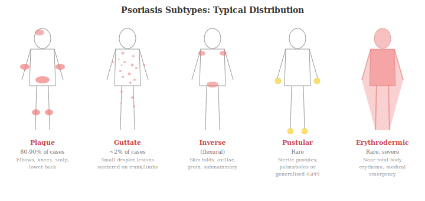
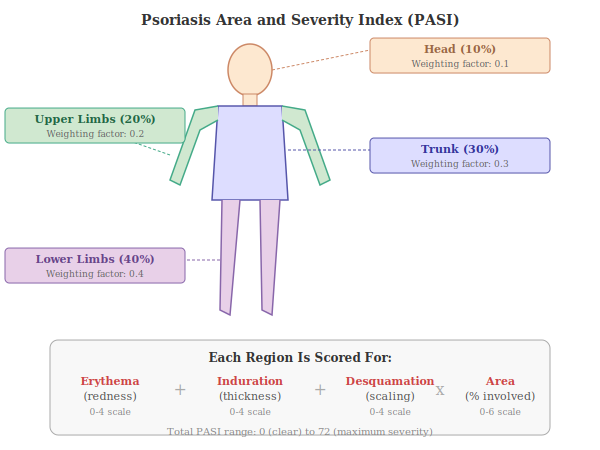

## 10.1 Types of Psoriasis

Psoriasis encompasses several clinical variants [(Griffiths et al., 2021)](https://www.thelancet.com/journals/lancet/article/PIIS0140-6736(20)32549-6/abstract):

- **Plaque psoriasis (psoriasis vulgaris)**: The most common form, accounting for approximately 80-90% of cases. It presents as well-demarcated, raised, erythematous (red) plaques covered with silvery-white scales, typically on the elbows, knees, scalp, and lower back.
- **Guttate psoriasis**: Characterised by small, droplet-shaped lesions scattered across the trunk and limbs. Often triggered by streptococcal throat infection, particularly in young adults.
- **Inverse (flexural) psoriasis**: Affects skin folds (axillae, groin, submammary areas) with smooth, red, inflamed patches lacking the typical scaling.
- **Pustular psoriasis**: Features sterile (non-infectious) pustules. Can be localised (palmoplantar pustulosis) or generalised (a medical emergency). Generalised pustular psoriasis (GPP) has a distinct genetic and immunological profile involving the IL-36 pathway.
- **Erythrodermic psoriasis**: A rare, severe form involving widespread inflammation and erythema covering most of the body surface. It can be life-threatening and requires urgent medical attention.
- **Nail psoriasis**: Affects fingernails and toenails, causing pitting, discolouration, onycholysis (separation of the nail from the nail bed), and subungual hyperkeratosis. Present in up to 50% of patients with plaque psoriasis.

## 10.2 Histopathology (What Psoriatic Skin Looks Like Under a Microscope)

Under the microscope, psoriatic skin shows characteristic features: acanthosis (thickening of the epidermis, the skin's outer layer), elongation of rete ridges (finger-like projections of the epidermis pushing down into the dermis, the deeper skin layer), dilated and tortuous (swollen and twisted) blood vessels in the dermal papillae (the bumpy upper surface of the dermis), a mixed inflammatory infiltrate (a collection of various immune cells that have migrated into the tissue) of T cells and dendritic cells in the dermis, and collections of neutrophils called Munro microabscesses (tiny pockets of white blood cells) in the epidermis [(Armstrong & Read, 2020)](https://pubmed.ncbi.nlm.nih.gov/32427307/).

## 10.3 Measurement of Severity

Disease severity is commonly measured using the **Psoriasis Area and Severity Index (PASI)**, which scores redness, thickness, scaling, and the percentage of body surface area affected, on a scale from 0 to 72. A PASI score below 10 generally indicates mild disease, while scores above 10 indicate moderate-to-severe disease. Treatment efficacy in clinical trials is typically reported as the percentage of patients achieving PASI 75 (75% improvement), PASI 90, or PASI 100 (complete clearance) [(Armstrong & Read, 2020)](https://pubmed.ncbi.nlm.nih.gov/32427307/).

### Quality of Life Instruments

Psoriasis affects far more than the skin, and several validated instruments exist to measure its broader impact. These are used in clinical trials, NICE technology appraisals, and increasingly in routine clinical practice:

- **Dermatology Life Quality Index (DLQI)** -- the most widely used quality of life measure in psoriasis. It's a 10-question questionnaire covering symptoms, daily activities, leisure, work/school, personal relationships, and treatment burden over the previous week. Scores range from 0 (no impact) to 30 (maximum impact). A score of 0-1 indicates no effect on quality of life; 2-5 small effect; 6-10 moderate effect; 11-20 very large effect; 21-30 extremely large effect. In the UK, a DLQI of 10 or above is one of the criteria (alongside PASI of 10 or above) used by NICE to define eligibility for biologic therapy [(Finlay & Khan, 1994)](https://pubmed.ncbi.nlm.nih.gov/8033378/).
- **Psoriasis Disability Index (PDI)** -- a 15-item questionnaire specifically designed for psoriasis, covering daily activities, employment, personal relationships, leisure, and treatment. It predates the DLQI and is still used in some studies.
- **Skindex-29** -- a 29-item dermatology-specific instrument that measures three domains: symptoms, emotions, and functioning. It provides a more detailed psychological profile than the DLQI.
- **SF-36 (Short Form 36)** -- a generic (not disease-specific) health questionnaire widely used across medicine. It allows comparison of psoriasis impact with that of other chronic diseases such as diabetes, heart failure, and cancer. These comparisons consistently show psoriasis to have a quality-of-life impact comparable to these conditions.
- **EQ-5D** -- a generic health utility measure used by NICE and other health technology assessment bodies for cost-effectiveness analysis. It captures five dimensions: mobility, self-care, usual activities, pain/discomfort, and anxiety/depression, and generates a single utility score used in health economic modelling.
- **Patient Benefit Index (PBI)** -- unlike the instruments above, the PBI asks patients to rate the importance of specific treatment goals (e.g. "to be free from itching", "to be able to go swimming") *before* treatment and then rates achievement *after* treatment, providing a patient-centred measure of treatment benefit that captures what matters most to each individual.

### Alternative and Supplementary Scoring Systems

PASI remains the gold standard in clinical trials, but it has well-recognised limitations in everyday practice: it's time-consuming (taking 5-10 minutes per assessment), requires training for consistent use, has poor sensitivity in mild disease, and shows substantial inter-rater variability even among experienced dermatologists [(Bozek & Reich, 2017)](https://pmc.ncbi.nlm.nih.gov/articles/PMC6181091/). Several complementary scoring systems address these limitations:

- **Investigator's Global Assessment (IGA)** -- a 5-point scale (0 = clear, 1 = almost clear, 2 = mild, 3 = moderate, 4 = severe) providing a rapid, holistic assessment of disease severity. The IGA is increasingly used as a co-primary endpoint in clinical trials alongside PASI. IGA 0/1 (clear or almost clear) shows strong association with PASI 90 and is simpler to perform in routine clinical practice [(Bozek & Reich, 2017)](https://pmc.ncbi.nlm.nih.gov/articles/PMC6181091/).
- **PGA x BSA (Physician's Global Assessment x Body Surface Area)** -- a composite score that multiplies a physician's overall severity rating by the percentage of body surface area affected. This measure is more sensitive than PASI for detecting change in mild-to-moderate disease and easier to calculate. It has been validated as a reliable alternative to PASI in clinical trial settings [(Manchanda et al., 2023)](https://pmc.ncbi.nlm.nih.gov/articles/PMC10389140/).
- **mNAPSI (modified Nail Psoriasis Severity Index)** -- specifically quantifies nail disease severity, which PASI doesn't capture. It assesses 8 features in each nail (pitting, onycholysis, crumbling, oil drop discolouration, leukonychia, splinter haemorrhages, hyperkeratosis, and red spots in the lunula) on a 0-130 scale for all 10 fingernails. This is essential for clinical trials of nail-specific endpoints and for monitoring response in patients where nail disease is the primary concern.
- **BSA alone** -- while simple to measure (using the "rule of nines" or the palm method, where the patient's palm is approximately 1% BSA), body surface area alone doesn't capture lesion quality (erythema, induration, scale) and therefore underestimates the impact of thick, heavily inflamed plaques on a small area.
- **DLQI as a treatment target** -- although a quality-of-life instrument rather than a severity score, DLQI is increasingly used as a co-primary treatment target in clinical guidelines. A DLQI of 0 or 1 (no impact on quality of life) is now considered the aspirational treatment goal alongside PASI 90/100 in many guideline frameworks.

**Research stage: Established.** **Evidence strength: High.** These instruments are widely used in clinical trials and endorsed by international consensus guidelines.
