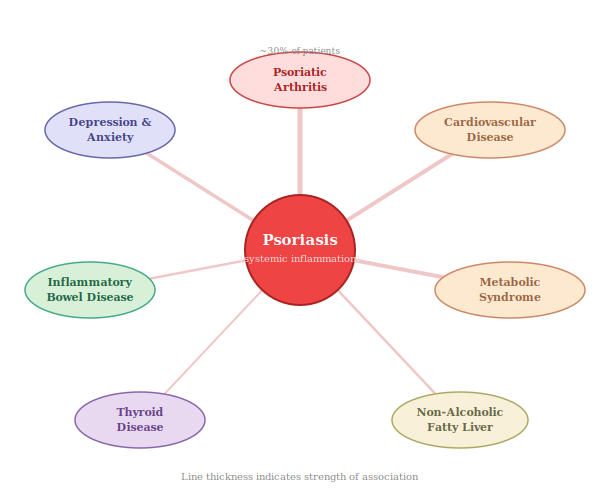
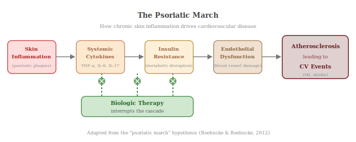

Psoriasis is now firmly recognised as a systemic inflammatory condition, associated with a range of comorbidities that extend well beyond the skin. In 2019, the American Academy of Dermatology and the National Psoriasis Foundation published comprehensive guidelines identifying the following conditions as psoriasis comorbidities [(National Psoriasis Foundation, 2024)](https://www.psoriasis.org/related-conditions/).

## 10.1 Psoriatic Arthritis (PsA)

The most common comorbidity. An estimated 30–33% of people with psoriasis develop psoriatic arthritis, which causes pain, swelling, and stiffness in the joints. Skin disease precedes joint disease in the majority of cases. Certain HLA-B alleles, particularly HLA-B*27, are associated with increased PsA risk, whereas HLA-C*06:02 — the major skin psoriasis risk allele — is not specifically linked to PsA [(Capon, 2020)](https://pmc.ncbi.nlm.nih.gov/articles/PMC9128944/).

## 10.2 Cardiovascular Disease

Patients with severe psoriasis have an elevated risk of myocardial infarction (heart attack), stroke, atherosclerosis (build-up of fatty plaques inside arteries), and cardiovascular mortality. The chronic systemic inflammation of psoriasis — driven by the same TNF-α/IL-23/IL-17 axis — promotes endothelial dysfunction (damage to the inner lining of blood vessels), insulin resistance, and atherogenesis (the process of artery-clogging plaque formation) through shared inflammatory pathways [(Hu & Lan, 2017)](https://www.mdpi.com/1422-0067/18/10/2211). A meta-analysis encompassing 42,000 psoriasis patients found the odds ratio for metabolic syndrome was as high as 2.26 [(Mehta et al., 2021)](https://www.jacc.org/doi/10.1016/j.jacc.2021.02.009). Intriguingly, treatment with TNF-α inhibitors has been shown to significantly decrease the risk of myocardial infarction in psoriasis patients [(Hu & Lan, 2017)](https://www.mdpi.com/1422-0067/18/10/2211).

## 10.3 Metabolic Syndrome

Psoriasis is significantly associated with obesity, type 2 diabetes, hypertension, and dyslipidemia (unhealthy levels of fats in the blood) — a cluster of conditions known as **metabolic syndrome**. The release of excessive pro-inflammatory cytokines such as TNF-α and IL-1 from psoriatic inflammation causes chronic low-grade systemic inflammation, which promotes insulin resistance (where the body's cells stop responding properly to insulin), visceral adiposity (accumulation of fat around internal organs), and dyslipidemia [(Takahashi & Iizuka, 2012)](https://pmc.ncbi.nlm.nih.gov/articles/PMC5519460/). Psoriasis patients have been shown to have up to 15% lower HDL cholesterol and dramatically reduced HDL efflux capacity, with a lipid profile resembling that of diabetic patients [(Mehta et al., 2021)](https://www.jacc.org/doi/10.1016/j.jacc.2021.02.009).

## 10.4 Mental Health

Psoriasis significantly affects mental health. Patients are approximately 40% more likely to carry a diagnosis of depression and experience elevated rates of anxiety, social stigma, and reduced quality of life [(Mehta et al., 2021)](https://www.jacc.org/doi/10.1016/j.jacc.2021.02.009). The visible nature of the disease contributes to shame, social withdrawal, and in severe cases, suicidal ideation [(Takahashi & Iizuka, 2012)](https://pmc.ncbi.nlm.nih.gov/articles/PMC5519460/).

## 10.5 Inflammatory Bowel Disease (IBD)

Psoriasis and IBD (Crohn's disease and ulcerative colitis) share common immune pathways and genetic susceptibility loci. The prevalence of IBD in psoriasis patients is approximately four times higher than in the general population [(Ni & Chiu, 2014)](https://www.dovepress.com/psoriasis-and-comorbidities-links-and-risks-peer-reviewed-fulltext-article-CCID).

## 10.6 Non-Alcoholic Fatty Liver Disease (NAFLD)

NAFLD prevalence is significantly higher in psoriasis patients, particularly those with more severe skin disease. This has important implications for treatment selection, as several systemic psoriasis therapies are hepatotoxic (can cause liver damage) [(Johnson, 2024)](https://dermnppa.org/what-we-know-about-psoriasis-comorbidities-and-their-management/).

## 10.7 The "Psoriatic March" Hypothesis

A unifying hypothesis known as the **"psoriatic march"** proposes that chronic cutaneous (skin-based) inflammation in psoriasis induces systemic inflammation, which leads progressively to insulin resistance, endothelial dysfunction (damage to blood vessel linings), atherosclerosis, and ultimately cardiovascular events. This model suggests that effective early treatment of psoriasis may help prevent the cascade of cardiometabolic comorbidities [(Hu & Lan, 2017)](https://www.mdpi.com/1422-0067/18/10/2211).
