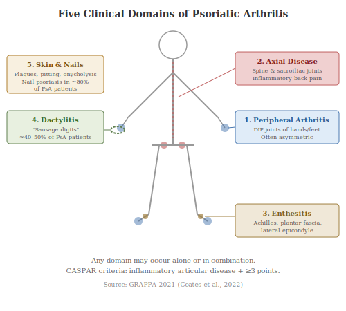

Psoriatic arthritis (PsA) affects approximately 30% of people with psoriasis and is one of the most important comorbidities of the disease. Section 14.1 introduced PsA as a comorbidity; this chapter provides a more detailed account of its clinical features, diagnosis, and management. If you have psoriasis, this is information worth knowing in depth.

## 15.1 The Five Clinical Domains

PsA isn't a single disease pattern. It encompasses five distinct clinical domains, any of which may occur alone or in combination [(Coates et al., 2022)](https://pubmed.ncbi.nlm.nih.gov/35761070/):

- **Peripheral arthritis** is the most common domain, affecting the small and large joints of the limbs. Unlike rheumatoid arthritis, PsA typically presents asymmetrically (affecting joints on one side more than the other) and has a predilection for the distal interphalangeal (DIP) joints of the fingers and toes, the joints closest to the nails. Swelling, pain, stiffness, and reduced range of motion are the hallmark symptoms.
- **Axial disease** involves inflammation of the spine and sacroiliac joints (the joints connecting the spine to the pelvis), presenting as inflammatory back pain: insidious onset, worse in the morning or after rest, improving with exercise, and often accompanied by prolonged morning stiffness lasting more than 30 minutes. Axial PsA occurs in approximately 25–70% of PsA patients, depending on how strictly it's defined.
- **Enthesitis** is inflammation at the points where tendons and ligaments insert into bone (entheses). Common sites include the Achilles tendon insertion, the plantar fascia (sole of the foot), and the lateral epicondyles (outer elbow). Enthesitis is a hallmark feature of PsA that distinguishes it from rheumatoid arthritis, where it's rare.
- **Dactylitis** is diffuse swelling of an entire digit ("sausage finger" or "sausage toe"), caused by a combination of joint inflammation, tenosynovitis (inflammation of the tendon sheath), and soft tissue oedema. Dactylitis occurs in approximately 40–50% of PsA patients and is highly suggestive of PsA when present.
- **Skin and nail disease**: psoriatic skin plaques and nail changes (pitting, onycholysis, subungual hyperkeratosis) are integral to PsA and often provide the diagnostic clue. Nail psoriasis is present in approximately 80% of PsA patients, compared with ~50% of psoriasis patients without arthritis, and is a strong predictor of future PsA development.

## 15.2 The CASPAR Diagnostic Criteria

The Classification Criteria for Psoriatic Arthritis (CASPAR) were developed by Taylor et al. in 2006 from a large international study of 588 PsA cases and 536 controls [(Taylor et al., 2006)](https://pubmed.ncbi.nlm.nih.gov/16871531/). To meet the CASPAR criteria, a patient must have inflammatory articular disease (involving joints, spine, or entheses) plus ≥3 points from the following:

1. **Current psoriasis** (2 points), or personal history of psoriasis (1 point), or family history of psoriasis (1 point)
2. **Typical psoriatic nail dystrophy** (pitting, onycholysis, hyperkeratosis) observed on current examination (1 point)
3. **Negative rheumatoid factor** (RF), tested by any method except latex agglutination (1 point)
4. **Current dactylitis** or history of dactylitis recorded by a rheumatologist (1 point)
5. **Radiographic evidence of juxta-articular new bone formation** (ill-defined ossification near joint margins, excluding osteophytes) on plain radiographs of the hand or foot (1 point)

The CASPAR criteria have a specificity of 98.7% and sensitivity of 91.4%, making them reliable for classification. Current psoriasis scores 2 points rather than 1, reflecting the strong diagnostic weight of active skin disease.

## 15.3 Imaging Findings

Imaging plays an important role in diagnosing and monitoring PsA:

- **Plain radiographs** may show erosions, joint space narrowing, and two features relatively specific to PsA: **juxta-articular new bone formation** (proliferative bone changes near joints, unlike the purely erosive pattern of rheumatoid arthritis) and, in severe cases, the **"pencil-in-cup" deformity**. In this deformity, erosion sharpens the distal end of one phalanx to a pencil-like point while the adjacent bone base erodes into a cup-like concavity. It's characteristic of arthritis mutilans, the most destructive form of PsA, which occurs in approximately 5% of PsA patients.
- **Ultrasound** is more sensitive than clinical examination for detecting active synovitis, enthesitis, and tenosynovitis, and is increasingly used in clinical practice for early detection and monitoring.
- **MRI** is the most sensitive imaging modality, capable of detecting bone marrow oedema, enthesitis, dactylitis, and early erosions before they become visible on plain radiographs.

## 15.4 Differentiating PsA from Rheumatoid Arthritis

PsA and rheumatoid arthritis (RA) can both cause joint inflammation and destruction, but several features help distinguish them:

- **Serology:** PsA is typically seronegative. Rheumatoid factor (RF) and anti-cyclic citrullinated peptide (anti-CCP) antibodies are usually absent. RA is seropositive in approximately 80% of cases.
- **Joint distribution:** PsA characteristically affects the DIP joints and may be asymmetric. RA typically affects the metacarpophalangeal (MCP) and proximal interphalangeal (PIP) joints symmetrically, and classically spares the DIP joints.
- **Enthesitis and dactylitis** are hallmarks of PsA and are rare in RA.
- **Axial involvement** occurs in PsA but not in RA.
- **Radiographic pattern:** PsA shows both erosion and new bone formation (a "mixed" pattern); RA shows erosion without significant new bone formation.
- **Skin and nails:** The presence of psoriasis or psoriatic nail changes strongly favours PsA.

## 15.5 The Importance of Early Diagnosis

A landmark study by Haroon et al. (2015) demonstrated that a diagnostic delay of more than 6 months from symptom onset to first rheumatology consultation was associated with significantly worse outcomes: more peripheral joint erosions, higher rates of sacroiliitis, more joint deformity, and worse functional disability [(Haroon et al., 2015)](https://pubmed.ncbi.nlm.nih.gov/24525911/). Even a 6-month delay contributed to irreversible joint damage that subsequent treatment couldn't fully recover.

This finding underscores why clinicians should screen all psoriasis patients for early signs of PsA (joint pain, stiffness, swelling, entheseal tenderness, or dactylitis) and refer promptly to rheumatology when PsA is suspected. Screening tools such as the PEST (Psoriasis Epidemiology Screening Tool) questionnaire can identify patients in dermatology clinics who may need rheumatology assessment [(Ibrahim et al., 2009)](https://pubmed.ncbi.nlm.nih.gov/19174392/).

## 15.6 Treatment Algorithms

PsA treatment follows a domain-based approach, as recommended by the Group for Research and Assessment of Psoriasis and Psoriatic Arthritis (GRAPPA) 2021 guidelines [(Coates et al., 2022)](https://pubmed.ncbi.nlm.nih.gov/35761070/):

**Peripheral arthritis.** First-line treatment is NSAIDs (non-steroidal anti-inflammatory drugs) for mild disease. If that's inadequate, conventional synthetic DMARDs (disease-modifying anti-rheumatic drugs), principally methotrexate, are used. For moderate-to-severe disease or DMARD failure, biologic therapies are indicated: TNF-α inhibitors, IL-17 inhibitors, IL-23 inhibitors, and JAK inhibitors are all effective. IL-12/23 inhibition (ustekinumab) and PDE4 inhibition (apremilast) are alternatives.

**Axial disease.** Conventional DMARDs (including methotrexate) are **not effective** for axial PsA. That's an important difference from peripheral disease. NSAIDs are first-line, and biologic therapies (TNF-α inhibitors, IL-17 inhibitors, JAK inhibitors) are used for inadequate NSAID response. One important caveat: IL-23 inhibitors, despite their effectiveness for peripheral arthritis and skin disease, are **not recommended** for axial PsA per the 2021 GRAPPA guidelines.

**Enthesitis.** NSAIDs are first-line. Biologics, particularly IL-17 inhibitors and TNF-α inhibitors, are effective for refractory enthesitis.

**Dactylitis.** NSAIDs and local corticosteroid injections are first-line. Biologics are indicated for refractory or recurrent dactylitis.

**Skin and nails.** Managed as described in the topical treatments (Section 23) and therapeutic landscape (Section 24) chapters. The important point is that treatment choice should ideally address both skin and joint disease domains simultaneously where possible.

## 15.7 The Treat-to-Target Approach

Current guidelines recommend a **treat-to-target (T2T)** strategy for PsA. This means treatment is adjusted systematically to achieve a predefined goal (typically remission or low disease activity) rather than simply responding to symptoms as they arise. The approach, borrowed from rheumatology where it proved successful in RA, involves regular assessment of disease activity using validated composite measures and escalation of therapy if the target isn't achieved within a defined timeframe. The principal composite measures used in PsA include:

- **DAPSA** (Disease Activity in Psoriatic Arthritis) focuses on peripheral joint disease, combining tender and swollen joint counts, patient pain and global assessments, and CRP. Remission is defined as DAPSA ≤4 and low disease activity as ≤14.
- **MDA** (Minimal Disease Activity) is a composite across domains; a patient is in MDA when meeting 5 of 7 criteria covering joints, enthesitis, skin, pain, patient global, and function. This is the most widely used T2T target in PsA clinical trials.
- **PASDAS** (Psoriatic Arthritis Disease Activity Score) integrates joint counts, patient and physician assessments, CRP, SF-36 physical component, and enthesitis into a continuous score.
- **CPDAI** (Composite Psoriatic Disease Activity Index) uniquely assesses all five clinical domains of PsA separately, making it the most comprehensive domain-level assessment.

The TICOPA trial demonstrated that T2T in PsA leads to better outcomes than routine care, including less radiographic progression and better functional outcomes [(Coates et al., 2015)](https://pubmed.ncbi.nlm.nih.gov/26673831/). The challenge lies in PsA's multi-domain nature. A patient may achieve remission in one domain (e.g. skin) while remaining active in another (e.g. enthesitis). That means comprehensive assessment across all domains at each visit is essential.

## 15.8 Rheumatology Co-Management

Optimal PsA care requires collaboration between dermatology and rheumatology. Dermatologists are best placed to manage skin and nail disease, screen for early PsA, and initiate appropriate referrals. Rheumatologists bring expertise in joint examination, imaging interpretation, and the management of complex musculoskeletal disease. Shared care pathways, including combined dermatology-rheumatology clinics where both specialists see the patient together, represent best practice but remain uncommon. The pathogenesis of PsA involves the same IL-23/IL-17 axis that drives skin psoriasis [(Veale & Fearon, 2018)](https://pubmed.ncbi.nlm.nih.gov/29893226/), which means many biologic therapies work for both skin and joint disease, facilitating unified treatment strategies.
