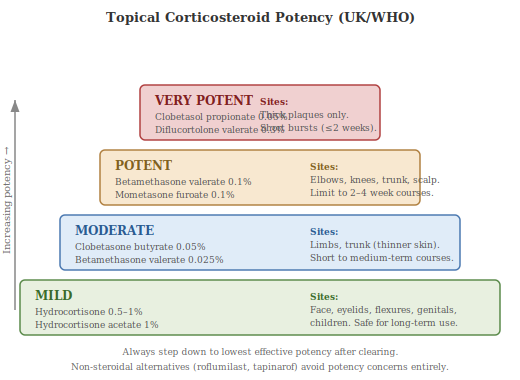
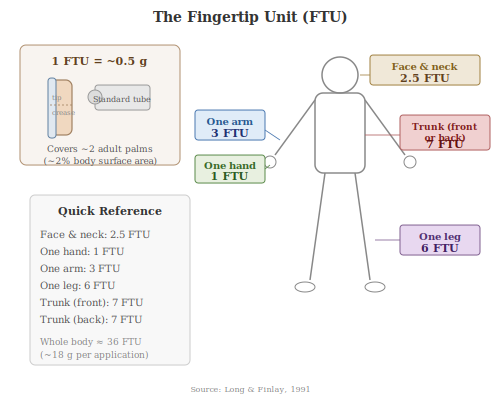

Topical therapies remain the cornerstone of psoriasis management. The majority of patients have mild-to-moderate disease that can be controlled with agents applied directly to the skin, and even those on systemic or biologic therapy often use topicals as adjuncts. This chapter surveys the major classes of topical treatment, from long-established options to agents approved in the 2020s.

## 15a.1 Topical Corticosteroids

Topical corticosteroids are the most widely prescribed treatment for psoriasis. They work by suppressing inflammation, reducing keratinocyte proliferation, and constricting blood vessels in the skin. Potency classification varies by country. The **US system** uses seven classes (class I being the most potent, class VII the mildest), while the **UK/WHO system** groups agents into four tiers: mild (e.g. hydrocortisone 1%), moderate (e.g. clobetasone butyrate), potent (e.g. betamethasone valerate 0.1%, mometasone furoate), and very potent (e.g. clobetasol propionate 0.05%) [(Elmets et al., 2021)](https://pubmed.ncbi.nlm.nih.gov/32738429/).

**Body-site selection is critical.** Very potent or potent preparations are appropriate for thick plaques on the elbows, knees, and trunk. Moderate-potency agents suit thinner-skinned areas such as the limbs. Mild preparations should be used on the face, flexures (skin folds), and genitals, where the skin is thinner, more permeable, and more susceptible to steroid side effects such as atrophy (thinning), striae (stretch marks), and telangiectasia (visible small blood vessels). Potent corticosteroids are generally limited to courses of two to four weeks on the body, with step-down to lower potency or alternate-day use for maintenance [(Kleyn et al., 2019)](https://www.tandfonline.com/doi/full/10.1080/09546634.2019.1620502).

## 15a.2 Vitamin D Analogues

Vitamin D analogues — **calcipotriol** (known as calcipotriene in the US), **calcitriol**, and **tacalcitol** — bind to the vitamin D receptor on keratinocytes, slowing their excessive proliferation and promoting normal differentiation. They also have immunomodulatory effects, reducing the production of pro-inflammatory cytokines [(Lebwohl & Ortonne, 2004)](https://pmc.ncbi.nlm.nih.gov/articles/PMC3219168/). Calcipotriol is the most extensively studied and most commonly prescribed. It is roughly equivalent in efficacy to a moderately potent corticosteroid but without the risk of skin atrophy, making it suitable for long-term use.

The **fixed-dose combination of calcipotriol with betamethasone dipropionate** (a potent corticosteroid) — available as an ointment, gel, and foam — is recommended by American and European guidelines as a first-line topical treatment for mild-to-moderate plaque psoriasis. The combination is more effective than either component alone, with a rapid onset of action (significant improvement within one week) and a favourable safety profile for use up to one year on an as-needed basis [(Segaert et al., 2019)](https://pubmed.ncbi.nlm.nih.gov/34036631/).

## 15a.3 Calcineurin Inhibitors

**Tacrolimus** (0.03% and 0.1% ointment) and **pimecrolimus** (1% cream) are topical calcineurin inhibitors (TCIs) licensed for atopic dermatitis but used **off-label** for psoriasis on the face, flexures, and genitals — sites where corticosteroid side effects are of greatest concern. They work by inhibiting calcineurin, a phosphatase enzyme required for T-cell activation and cytokine production, thereby dampening local immune responses without causing skin atrophy [(Kroft et al., 2014)](https://pmc.ncbi.nlm.nih.gov/articles/PMC5683124/).

A systematic review found that tacrolimus 0.1% ointment was effective for facial and intertriginous psoriasis, with clinical improvement visible within eight days, and that both agents were generally well tolerated with few local adverse effects [(Tsai & Huang, 2023)](https://pmc.ncbi.nlm.nih.gov/articles/PMC10026016/). The most common side effect is a transient burning or stinging sensation upon application. Calcineurin inhibitors are particularly valuable as steroid-sparing agents in sensitive areas requiring long-term management.

## 15a.4 Coal Tar

Coal tar is one of the oldest treatments for psoriasis, documented in medical texts for over a century. It is a complex mixture of thousands of compounds derived from the distillation of coal. Its mechanism of action is not fully elucidated, but the active component **carbazole** activates the aryl hydrocarbon receptor (AhR) — the same receptor targeted by the newer drug tapinarof — reducing keratinocyte proliferation, suppressing inflammation (by inhibiting IL-15 and inducible nitric oxide synthase), and exerting anti-angiogenic effects [(Roelofzen et al., 2017)](https://pubmed.ncbi.nlm.nih.gov/28814117/).

Modern formulations (shampoos, foams, creams, and solutions at 1–5% concentration) are substantially more cosmetically acceptable than the crude preparations of the past, which were malodorous and stained clothing and skin. Coal tar remains useful as an adjunct, particularly in combination with phototherapy (the **Goeckerman regimen**: coal tar plus UVB) and for scalp psoriasis [(Avalos-Viveros et al., 2023)](https://onlinelibrary.wiley.com/doi/10.1111/ijd.16193).

## 15a.5 Dithranol (Anthralin)

**Dithranol** (known as anthralin in the US) is a synthetic compound that reduces keratinocyte proliferation and modulates immune function, though its precise mechanism remains incompletely understood. It can be highly effective but is limited by skin irritation and brown-purple staining of skin and clothing.

**Short-contact therapy** — applying stronger concentrations (1–2%) for 30 minutes to one hour, then washing off — exploits the fact that dithranol penetrates psoriatic (abnormal) skin more rapidly than healthy skin, allowing therapeutic benefit while minimising irritation. The traditional **Ingram regimen** (a hospital-based protocol combining coal tar baths, UVB phototherapy, and dithranol paste application) was a mainstay of inpatient psoriasis care for decades and remains in limited use in some specialist centres [(Statham & Rowell, 1984)](https://pubmed.ncbi.nlm.nih.gov/6733040/).

## 15a.6 Keratolytics

**Salicylic acid** (2–10%) and **urea** (10–40%) are keratolytic agents (substances that soften and break down the thickened outer layer of skin). In psoriasis, thick scale physically blocks the penetration of other topical drugs. Keratolytics remove this barrier, and salicylic acid in particular has been shown to enhance the penetration and efficacy of concurrently applied corticosteroids [(Jacobi et al., 2015)](https://www.ncbi.nlm.nih.gov/pmc/articles/PMC4374065/). Urea at higher concentrations (20–40%) is keratolytic, while at lower concentrations (5–10%) it acts primarily as a humectant (a substance that draws moisture into the skin). International guidelines recommend keratolytics as adjuvant therapy across all severity levels of psoriasis.

## 15a.7 Topical Retinoids: Tazarotene

**Tazarotene** is a receptor-selective retinoid (vitamin A derivative) that binds to retinoic acid receptors RARbeta and RARgamma in the skin. It normalises keratinocyte differentiation, reduces hyperproliferation, and has anti-inflammatory effects [(Weinstein et al., 1997)](https://www.sciencedirect.com/science/article/abs/pii/S0190962297803957). In clinical trials, tazarotene 0.1% gel or cream reduced plaque elevation, scaling, and erythema, and demonstrated lower post-treatment relapse rates than topical corticosteroids alone.

Its main limitation is **local irritation** — erythema, burning, and peeling at the application site — which can be mitigated by combining it with a mid-to-high potency corticosteroid. A fixed-dose combination of tazarotene with halobetasol propionate is available. Tazarotene is **teratogenic** (harmful to a developing foetus) and is contraindicated in pregnancy or in women planning to conceive.

## 15a.8 Roflumilast Cream (Zoryve)

**Roflumilast cream** (brand name Zoryve) is a topical **phosphodiesterase-4 (PDE4) inhibitor** — the same enzyme target as the oral drug apremilast, but delivered directly to the skin. PDE4 inhibition raises intracellular cyclic AMP levels, which dampens the production of pro-inflammatory cytokines including TNF-alpha, IL-17, and IL-23. The 0.3% cream was **FDA-approved in July 2022** for plaque psoriasis in patients aged 12 and over, including use on intertriginous (skin-fold) areas, and the indication was **expanded in October 2023 to include children aged 6 and older**. A foam formulation for scalp and body psoriasis was subsequently approved in 2025 [(FDA, 2022)](https://www.accessdata.fda.gov/drugsatfda_docs/label/2022/215985s000lbl.pdf).

Roflumilast cream is notable for being steroid-free with no restrictions on treatment duration or application site, making it particularly useful for sensitive areas and long-term management.

## 15a.9 Tapinarof (Vtama)

**Tapinarof** (brand name Vtama) is a first-in-class topical **aryl hydrocarbon receptor (AhR) agonist**, approved by the FDA in May 2022 for plaque psoriasis in adults. It was the first non-steroidal topical novel chemical entity approved for psoriasis in the United States in over 25 years. Tapinarof activates the AhR, a transcription factor that regulates genes involved in skin barrier function, immune response, and oxidative stress — reducing Th17-related cytokine production and promoting epidermal differentiation [(Lebwohl et al., 2021)](https://pubmed.ncbi.nlm.nih.gov/34879448/).

In the pivotal PSOARING phase 3 trials, tapinarof 1% cream applied once daily achieved a Physician Global Assessment score of 0 (clear) or 1 (almost clear) in 36–40% of patients at 12 weeks, compared with 6% on vehicle. Notably, patients who achieved clearance in the trials demonstrated a **"remittive effect"** — a median of approximately four months before disease worsening after stopping treatment — a property not seen with conventional topicals [(Lebwohl et al., 2021)](https://pubmed.ncbi.nlm.nih.gov/34879448/). Like roflumilast, tapinarof has no duration-of-use limitations, offering an important advantage over corticosteroids.

## 15a.10 Addressing "Steroid Phobia"

**Corticosteroid phobia** — excessive fear of using topical steroids — is reported in 31–96% of dermatology patients and is a major driver of poor treatment adherence [(Li et al., 2021)](https://pubmed.ncbi.nlm.nih.gov/34287768/). Patients worry about skin thinning, "dependency", absorption into the bloodstream, and long-term harm, often fuelled by misinformation online or from well-meaning but uninformed contacts. In psoriasis, the consequence of underuse is preventable suffering: persistent plaques, impaired quality of life, and unnecessary escalation to systemic therapies.

Clinicians can address steroid phobia by: explaining that side effects are related to potency, site, and duration (and are largely avoidable with appropriate use); distinguishing topical from systemic steroids; demonstrating application technique and appropriate quantities; and acknowledging patients' concerns without dismissing them. Studies show that targeted educational interventions — including short videos followed by personalised discussion — significantly reduce steroid phobia and improve adherence [(Li et al., 2021)](https://pubmed.ncbi.nlm.nih.gov/34287768/). The availability of newer non-steroidal topicals (tapinarof, roflumilast) also provides clinicians with steroid-free alternatives where patient anxiety cannot be resolved.

## 15a.11 Practical Application: Fingertip Units and Treatment Regimens

A common reason for topical treatment failure is **under-application**. The **fingertip unit (FTU)** system provides a practical guide: one FTU is the amount of cream or ointment squeezed from a standard tube along the length of an adult index finger, from the tip to the first crease. One FTU weighs approximately 0.5 g and covers an area roughly the size of two adult palms (about 2% of body surface area) [(Long & Finlay, 1991)](https://pubmed.ncbi.nlm.nih.gov/1764318/). As a rough guide: one hand requires approximately 1 FTU, one arm 3 FTUs, one leg 6 FTUs, the trunk (front or back) 7 FTUs, and the face and neck 2.5 FTUs.

**When to step down.** After achieving clearance or near-clearance with a potent corticosteroid (usually two to four weeks), patients should transition to a maintenance strategy: either stepping down to a lower-potency steroid, switching to a steroid-free agent (vitamin D analogue, calcineurin inhibitor, or one of the newer agents), or adopting a "weekend therapy" approach (applying potent steroid on two consecutive days per week to previously affected sites to prevent relapse). Emollients (moisturisers) should be used liberally and continuously regardless of disease activity — they reduce scaling, improve comfort, and may reduce the amount of active treatment needed [(Elmets et al., 2021)](https://pubmed.ncbi.nlm.nih.gov/32738429/).
