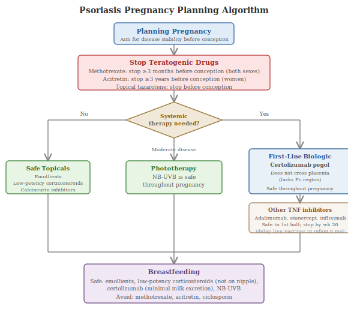

The experience of psoriasis differs significantly across certain population groups — in how the disease presents, how it is diagnosed, and which treatments are safe and appropriate. This section addresses three populations where these differences have important clinical and practical implications: pregnancy, children, and people with skin of colour.

## 21.1 Pregnancy and Conception

Pregnancy and psoriasis present a complex intersection, particularly relevant for patients who are trying to conceive or are already pregnant. The challenges are threefold: the natural course of psoriasis changes during pregnancy; many standard treatments are unsafe for the developing foetus; and the evidence base for drug safety in pregnancy is limited because pregnant women are routinely excluded from clinical trials.

**Natural course during pregnancy.** Approximately 40–60% of women with psoriasis experience improvement during pregnancy, likely due to the shift from Th1/Th17-dominant immunity towards a Th2-dominant profile that occurs naturally to protect the foetus from the mother's immune system [(Murase et al., 2005)](https://pubmed.ncbi.nlm.nih.gov/15793512/). However, roughly 10–20% of women experience worsening, and postpartum flares within the first few months after delivery are common.

**Treatments to avoid absolutely.** Two commonly used psoriasis drugs are known teratogens (substances that cause birth defects) and are absolutely contraindicated during pregnancy and conception:

- **Methotrexate** is highly teratogenic, associated with pregnancy loss and congenital anomalies including microcephaly, craniosynostosis, limb defects, and tetralogy of Fallot. It must be stopped at least 3 months before conception in women and at least 3 months in men (the BAD recommends the same washout for male patients, though evidence for male teratogenicity is less established).
- **Acitretin** (a retinoid) has an extremely prolonged elimination half-life and requires reliable contraception for 3 years after stopping treatment. Topical tazarotene (another retinoid) is also contraindicated.

**Safe topical options.** Emollients, low-to-moderate-potency topical corticosteroids, and calcineurin inhibitors (tacrolimus, pimecrolimus) are considered safe during pregnancy when used appropriately and not applied to the nipple area during breastfeeding. Narrowband UVB phototherapy is safe throughout pregnancy and is often the first-line choice for moderate disease.

**Biologics during pregnancy.** The landscape is evolving rapidly, with increasing evidence that biologics — previously avoided in pregnancy due to lack of data — may be safer than previously assumed:

- **Certolizumab pegol** is the preferred biologic during pregnancy. Unlike all other biologics, it lacks the Fc region (the part of the antibody that is actively transported across the placenta), so it does not cross the placenta in significant amounts. The landmark CRIB study confirmed negligible foetal exposure [(Mariette et al., 2018)](https://pubmed.ncbi.nlm.nih.gov/29030361/). Certolizumab is also minimally excreted in breast milk, making it safe during breastfeeding without modification of the infant vaccination schedule.
- **Other TNF inhibitors** (adalimumab, etanercept, infliximab) can be used during the first half of pregnancy. However, because they are IgG1 antibodies with Fc regions, they are actively transferred across the placenta during the second and third trimesters. If used beyond week 20, live vaccines (such as BCG and rotavirus) should be delayed in the infant until 6 months of age.
- **IL-17 and IL-23 inhibitors**: Data are more limited. A 2025 WHO pharmacovigilance analysis of over 140 million reports found that most biologics (including secukinumab, ixekizumab, guselkumab, and tildrakizumab) had lower frequencies of pregnancy-related adverse outcomes compared to TNF inhibitors. However, risankizumab showed a signal for increased abortion and stillbirth risk (ROR 1.87, 95% CI 1.32–2.63), requiring further investigation [(Jeong et al., 2025)](https://pubmed.ncbi.nlm.nih.gov/39626647/). Current consensus recommends discontinuing IL-17 and IL-23 inhibitors when pregnancy is confirmed unless no safer alternative exists.

**Guidance for patients trying to conceive.** Current BAD and European guidelines recommend: (1) plan the pregnancy during a period of disease stability; (2) if systemic treatment is needed during pregnancy, certolizumab pegol is first-line; (3) NB-UVB phototherapy is a safe non-drug option; (4) methotrexate and acitretin must be stopped well in advance; (5) cyclosporine can be used short-term in pregnancy if needed (it does not appear to be teratogenic, though it crosses the placenta).

## 21.2 Paediatric Psoriasis

Psoriasis begins in childhood in approximately one-third of all cases, with an estimated prevalence of 0.5–2% in children. It can present at any age, including infancy, though onset is more common during adolescence. Female children are affected slightly more frequently than males.

**Differences in presentation.** While children can develop any subtype of psoriasis, certain presentations are more common or appear differently than in adults:

- **Napkin psoriasis** (nappy-area psoriasis) can be the earliest manifestation, presenting as persistent, well-demarcated erythema in the nappy area of infants. It is often mistaken for nappy rash and may not develop classic silvery scale.
- **Facial involvement** is more common in children than adults (up to 50% of paediatric cases), as are involvement of the scalp and flexural areas.
- **Guttate psoriasis** is particularly common in children and is frequently triggered by streptococcal pharyngitis.
- **Thinner plaques** and finer scale are typical in younger children. Classic adult-pattern thick plaques develop more commonly in adolescence.

**Psychological impact.** The psychological burden of psoriasis in children should not be underestimated. Visible skin disease during formative years affects self-esteem, body image, peer relationships, and school attendance. Bullying and social isolation are frequently reported. Parents also experience significant psychological distress, including guilt and helplessness.

**Comorbidities start early.** Children with psoriasis already show increased rates of obesity (approximately double that of unaffected children), with central obesity developing around age 8. Metabolic screening is increasingly recommended in paediatric guidelines.

**Treatment.** Most paediatric psoriasis is mild and manageable with topical therapy: low-potency corticosteroids, vitamin D analogues (calcipotriol), calcineurin inhibitors for face and flexures, and emollients. NB-UVB phototherapy is safe in children. For moderate-to-severe disease, systemic options have expanded considerably in recent years. Biologics now approved for paediatric psoriasis (ages vary by drug and country) include etanercept, adalimumab, ustekinumab, secukinumab, and ixekizumab. Apremilast was approved for children aged 6–17 in April 2024 (USA) [(FDA, 2024)](https://pubmed.ncbi.nlm.nih.gov/39576565/). Roflumilast cream (a topical PDE4 inhibitor) was also approved for children aged 6 and over in October 2023 [(FDA, 2023)](https://www.accessdata.fda.gov/drugsatfda_docs/label/2024/215985s007lbl.pdf).

### Paediatric Dosing Reference Table

The following table summarises the approved biologic and oral agents for paediatric plaque psoriasis, with age cutoffs and weight-based dosing. Approval status differs between the FDA and EMA; clinicians should consult local regulatory guidance.

| Drug | Brand | Min. Age (FDA) | Min. Age (EMA) | Weight-Based Dosing | Schedule |
|---|---|---|---|---|---|
| Etanercept | Enbrel | ≥4 yr | ≥6 yr | 0.8 mg/kg (max 50 mg) | SC once weekly |
| Adalimumab | Humira | Not approved | ≥4 yr | 0.8 mg/kg load, then 0.4 mg/kg (max 40/20 mg) | SC every 2 weeks |
| Ustekinumab | Stelara | ≥6 yr | ≥6 yr | <60 kg: 0.75 mg/kg; 60–100 kg: 45 mg; >100 kg: 90 mg | SC wk 0, 4, then q12w |
| Secukinumab | Cosentyx | ≥6 yr | ≥6 yr | <50 kg: 75 mg; ≥50 kg: 150 mg | SC wk 0,1,2,3,4, then q4w |
| Ixekizumab | Taltz | ≥6 yr (≥25 kg) | ≥6 yr (≥25 kg) | 25–50 kg: 80→40 mg; >50 kg: 160→80 mg | SC load, then q4w |
| Apremilast | Otezla | ≥6 yr | Pending | 6–11 yr (≥15 kg): 20 mg BD; 12–17 yr (≥35 kg): 20–30 mg BD | Oral twice daily |

*SC = subcutaneous; q4w = every 4 weeks; q12w = every 12 weeks; BD = twice daily. Adalimumab is not FDA-approved for paediatric psoriasis but is EMA-approved. Apremilast is an oral PDE4 inhibitor, not a biologic. Growth monitoring is recommended with apremilast in children.*

## 21.3 Psoriasis in Skin of Colour

Psoriasis affects all racial and ethnic groups, but there are significant differences in prevalence, clinical presentation, diagnostic accuracy, treatment access, and outcomes. These disparities represent one of the most important equity issues in dermatology today.

**Prevalence.** While psoriasis prevalence is highest in white populations (approximately 3.6% in the US), it also affects Asian (2.5%), Hispanic (1.9%), and Black (1.5%) populations at substantial rates [(Armstrong et al., 2021)](https://doi.org/10.1001/jamadermatol.2021.2007). These lower rates may partly reflect underdiagnosis rather than true lower prevalence.

**Clinical presentation differs.** The classic teaching of psoriasis — red, well-demarcated, silvery-scaled plaques — describes the disease primarily as it appears on lighter skin. On darker skin tones, erythema (redness) may be far less visible or absent entirely. Instead, plaques may appear violaceous (purple), grey, dark brown, or hyperpigmented. Scale may appear grey rather than silvery. These differences mean that clinicians trained primarily on light-skin presentations may miss or misdiagnose psoriasis in patients with darker skin.

**Post-inflammatory hyperpigmentation (PIH)** — persistent dark discolouration at sites where plaques have healed — is a significant additional burden in skin of colour that is largely absent in lighter skin. PIH can persist for months to years after active disease has resolved and is often more distressing to patients than the plaques themselves.

**Diagnostic delays and disparities.** Research consistently demonstrates that racial and ethnic minority patients wait significantly longer for diagnosis — approximately 3 times longer than white patients — and are 3 times more likely to require a skin biopsy to confirm diagnosis (rather than receiving a clinical diagnosis). A 2024 NPF Health Indicator Report found that racial and ethnic minority individuals are 112% more likely to live with undiagnosed psoriasis [(NPF, 2024)](https://www.psoriasis.org/health-indicator-report/). An analysis of leading dermatology textbooks found that only 2% of clinical images depicted dark skin tones, contributing to a training gap that perpetuates diagnostic difficulty [(Adelekun et al., 2021)](https://pubmed.ncbi.nlm.nih.gov/32335181/).

**Treatment disparities.** Even after diagnosis, disparities persist. Black Medicare recipients in the US are 70% less likely to receive biologic therapy for severe psoriasis than white patients [(Takeshita et al., 2015)](https://doi.org/10.1038/jid.2015.296). Hospitalisation rates for psoriasis are significantly higher among Black (OR 1.28), Hispanic (OR 1.65), and Asian (OR 2.08) individuals compared to white individuals. Quality of life scores (DLQI) are consistently worse among Black (8.3), Hispanic (8.0), and Asian (7.9) patients compared to white patients (5.6) in the PSOLAR registry [(Takeshita et al., 2022)](https://doi.org/10.1016/j.jid.2022.02.013).

**Research gaps.** Clinical trials for new psoriasis medications have historically had very low representation of non-white participants, limiting knowledge of how treatments perform across diverse populations. The VISIBLE study (NCT05272150), initiated in 2022, was specifically designed to assess guselkumab in patients with skin of colour and represents a growing recognition of this evidence gap. HLA-C*06:02 positivity — the strongest genetic risk factor — is generally higher in white populations than in Asian populations, and few genome-wide association studies have focused on African ancestry, highlighting a critical genetic research gap.

## 21.4 Elderly Patients

Psoriasis in older adults (typically defined as age 65 and over) presents distinct management challenges that are not well addressed in clinical guidelines, despite the ageing population representing a growing proportion of psoriasis patients.

**Accumulated comorbidity burden.** Elderly patients with long-standing psoriasis carry the cumulative effects of decades of systemic inflammation — the "psoriatic march" (Section 14.7) — meaning they are more likely to have established cardiovascular disease, type 2 diabetes, chronic kidney disease, and hepatic impairment. These comorbidities complicate treatment selection: methotrexate may be contraindicated by renal or hepatic impairment, and ciclosporin carries heightened nephrotoxicity risk in patients with pre-existing renal disease or hypertension.

**Polypharmacy.** Older adults take an average of 5–8 medications, increasing the risk of drug interactions [(Balato et al., 2014)](https://pubmed.ncbi.nlm.nih.gov/24554398/). Methotrexate interacts with NSAIDs, trimethoprim, and proton pump inhibitors. Ciclosporin interacts with statins, calcium channel blockers, and many antibiotics. A thorough medication review is essential before initiating any systemic psoriasis therapy in elderly patients.

**Infection risk on biologics.** Age is an independent risk factor for serious infections. Registry data from PSOLAR have shown that older patients on biologic therapy have higher rates of serious infections than younger patients, though the absolute risk remains low [(Kalb et al., 2015)](https://pubmed.ncbi.nlm.nih.gov/25970800/). IL-23 inhibitors, with their more targeted mechanism and lower infection signal, may be preferred in this age group. Vaccination status should be reviewed and updated (including pneumococcal, influenza, and herpes zoster vaccines) before starting biologic therapy.

**Skin fragility.** Long-term topical corticosteroid use — common in patients who have managed psoriasis for decades — can cause skin atrophy (thinning), telangiectasia (visible small blood vessels), purpura (easy bruising), and impaired wound healing [(Barnes et al., 2015)](https://pubmed.ncbi.nlm.nih.gov/25862024/). These effects are particularly pronounced in elderly skin, which is already thinner due to age-related dermal atrophy. Low-potency corticosteroids, vitamin D analogues, and the newer non-steroidal topicals (roflumilast cream, tapinarof) may be preferable for long-term topical management in this group.

**Dosing adjustments.** Age-related decline in renal and hepatic function requires dosing vigilance. Methotrexate clearance decreases with reduced creatinine clearance, increasing toxicity risk. More frequent blood monitoring (FBC, LFTs, renal function) is recommended in elderly patients on conventional systemics.

**Undertreatment.** Despite the availability of effective biologic therapies, elderly patients are significantly less likely to receive biologics than younger patients. This may reflect clinician concern about infection risk, but it also leads to undertreated disease and reduced quality of life. Guidelines increasingly recognise that age alone should not be a contraindication to biologic therapy, and that the benefits of disease control must be weighed against individual risk factors on a case-by-case basis.
