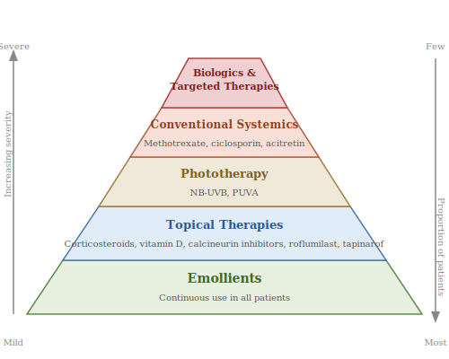
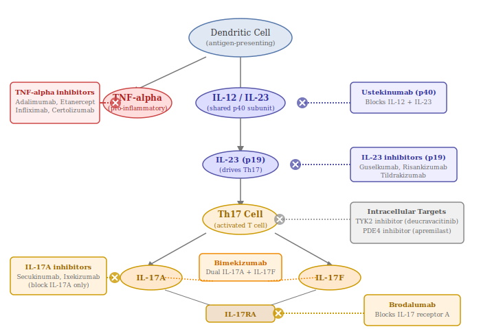

## 24.1 Overview of Treatment Approaches

Treatment for psoriasis is stratified by disease severity:

- **Mild disease**: Topical therapies (corticosteroids, vitamin D analogues, calcineurin inhibitors, keratolytics, and newer non-steroidal agents such as tapinarof and roflumilast). **Tapinarof (Vtama)**, FDA-approved in May 2022, is a first-in-class topical aryl hydrocarbon receptor (AhR) agonist that modulates skin immune responses and promotes skin barrier function without the atrophy risk of corticosteroids. **Roflumilast cream (Zoryve)** is a topical PDE4 inhibitor also offering a steroid-free alternative.
- **Moderate-to-severe disease**: Phototherapy, conventional systemic agents (methotrexate, cyclosporine, acitretin), small molecule inhibitors (apremilast, deucravacitinib), and biologic therapies.

The introduction of biologic therapies has revolutionised the treatment of moderate-to-severe psoriasis over the past two decades [(Armstrong & Read, 2020)](https://pubmed.ncbi.nlm.nih.gov/32427307/).

## 24.2 Biologic Therapies

Biologics are engineered proteins — typically antibodies (immune proteins that bind to and neutralise specific targets) or fusion proteins (lab-created molecules that combine parts of two different proteins) — designed to block specific components of the immune system. Unlike traditional drugs which are small chemical molecules, biologics are large, complex proteins manufactured in living cells. They are grouped by the immune target they block:

### TNF-α Inhibitors (First Generation)
The first biologics approved for psoriasis. These block TNF-α, a major pro-inflammatory cytokine. While effective, they have been superseded by newer agents with superior efficacy. TNF-α inhibitors remain valuable for patients with concurrent psoriatic arthritis, where they have strong evidence of efficacy, and their long-term safety profile is well-established [(ten Bergen et al., 2020)](https://onlinelibrary.wiley.com/doi/10.1111/sji.12946). Approved agents include:

- **Etanercept (Enbrel)**: A TNF receptor fusion protein (a lab-made molecule that mimics a natural TNF receptor, soaking up TNF like a sponge) given as a weekly subcutaneous injection (injected just under the skin, which patients can do at home). The lowest PASI 90 rates among biologics (~17.9%).
- **Adalimumab (Humira)**: A fully human monoclonal antibody (a lab-made antibody designed to target one specific molecule — in this case TNF-α — "monoclonal" means all copies are identical, and "fully human" means it is made entirely from human protein sequences, reducing the chance of the body rejecting it), given as a subcutaneous injection every two weeks. Once the world's best-selling drug. PASI 90 rates ~45%.
- **Infliximab (Remicade)**: A chimeric monoclonal antibody (part mouse, part human — "chimeric" comes from the mythological chimera, a creature made of different animals) given by intravenous infusion (delivered directly into a vein, requiring a visit to an infusion centre). Rapid onset of action but requires clinic visits.
- **Certolizumab pegol (Cimzia)**: A PEGylated antibody fragment (just the business end of an antibody, coated with a polymer called PEG to make it last longer in the body). Notably, it does not cross the placenta and is therefore considered the preferred biologic option during pregnancy.

### IL-12/23 Inhibitor
**Ustekinumab (Stelara)** targets the p40 subunit shared by IL-12 and IL-23, blocking both cytokines. It was the first biologic to target the IL-23 pathway and demonstrated that blocking upstream drivers of Th17 differentiation was highly effective. Administered subcutaneously every 12 weeks after induction, with weight-based dosing (45 mg for patients ≤100 kg, 90 mg for >100 kg) [(Armstrong & Read, 2020)](https://pubmed.ncbi.nlm.nih.gov/32427307/).

### IL-17 Inhibitors
These agents target IL-17 or its receptor, providing rapid skin clearance and addressing multiple disease domains including nails and scalp. IL-17 inhibitors achieve PASI 75–100 in 60–90% of patients [(Fotiadou et al., 2025)](https://www.mdpi.com/2313-5786/5/2/19). Approved agents include:

- **Secukinumab (Cosentyx)**: A fully human monoclonal antibody targeting IL-17A. Administered subcutaneously, typically every 4 weeks after a loading phase. Approved for adults and children aged 6+.
- **Ixekizumab (Taltz)**: A humanised monoclonal antibody targeting IL-17A. Among the highest PASI 90 response rates of any biologic. Given subcutaneously every 2 weeks during induction, then every 4 weeks.
- **Brodalumab (Siliq)**: Unique in that it targets the IL-17 receptor A (IL-17RA) rather than the cytokine itself, thereby blocking multiple IL-17 family members (IL-17A, IL-17F, IL-17C, IL-17E). Carries a boxed warning regarding suicidal ideation, requiring a Risk Evaluation and Mitigation Strategy (REMS) programme [(Menter et al., 2019)](https://pubmed.ncbi.nlm.nih.gov/30772098/).
- **Bimekizumab (Bimzelx)**: The newest IL-17 inhibitor (FDA-approved October 2023) [(Fatani et al., 2025)](https://www.tandfonline.com/doi/pdf/10.1080/14712598.2025.2495986). Uniquely inhibits both IL-17A and IL-17F simultaneously, providing among the highest skin clearance rates in clinical trials. Given subcutaneously every 4 weeks during induction, then every 8 weeks.

The main safety consideration with IL-17 inhibitors is an elevated risk of mucocutaneous candidiasis (yeast infections of mucosal surfaces), due to IL-17's physiological role in mucosal antifungal defence. There is also emerging evidence of a potential link between IL-17 inhibition and exacerbation of inflammatory bowel disease, making IL-17 inhibitors less suitable for patients with concurrent IBD [(Fatani et al., 2025)](https://www.tandfonline.com/doi/pdf/10.1080/14712598.2025.2495986).

### IL-23 Inhibitors (Selective p19)
These selectively target the p19 subunit unique to IL-23, blocking IL-23 without affecting IL-12. They represent the current state of the art for psoriasis treatment, offering superior efficacy in clinical trials with an excellent safety profile and extended dosing intervals [(Fatani et al., 2025)](https://www.tandfonline.com/doi/pdf/10.1080/14712598.2025.2495986). Network meta-analyses support IL-23 inhibitors as the most effective biological therapy class for moderate-to-severe psoriasis, with IL-17 inhibitors as a strong alternative [(Armstrong et al., 2021)](https://pubmed.ncbi.nlm.nih.gov/33788177/). Approved agents include:

- **Guselkumab (Tremfya)**: The first selective IL-23 inhibitor approved for psoriasis. Administered subcutaneously every 8 weeks after induction. Also approved for psoriatic arthritis.
- **Risankizumab (Skyrizi)**: Manufactured by AbbVie. Achieves the highest PASI 90 response rates (~71.6%) among IL-23 inhibitors. Given subcutaneously every 12 weeks after induction — the longest dosing interval of any injectable psoriasis biologic. Also approved for psoriatic arthritis and Crohn's disease.
- **Tildrakizumab (Ilumya)**: Administered subcutaneously every 12 weeks after induction. Ranked favourably for safety in network meta-analyses, with the anti-IL-23 class showing the lowest adverse event rates among biologic classes after placebo [(Sbidian et al., 2023)](https://www.cochranelibrary.com/cdsr/doi/10.1002/14651858.CD011535.pub6/full) [(Xie et al., 2025)](https://pmc.ncbi.nlm.nih.gov/articles/PMC12126413/). Efficacy builds more gradually than some competitors, reaching comparable levels by week 28.

### IL-36 Receptor Antagonist
**Spesolimab (Spevigo)** targets the IL-36 receptor and is specifically indicated for generalised pustular psoriasis (GPP), which has a distinct pathogenesis involving the IL-36 pathway rather than the IL-23/IL-17 axis [(Childs et al., 2025)](https://pmc.ncbi.nlm.nih.gov/articles/PMC11896623/).

## 24.3 Pricing and Cost Considerations

The cost of biologic therapies for psoriasis is substantial and has risen over time, creating a major barrier to access. A 2025 study published in *JAMA Dermatology* analysing US commercial insurance data from 2007 to 2021 found that the average annual cost of biologic treatment for psoriasis jumped from approximately $21,000 in 2007 to over $47,000 in 2021 [(Rome et al., 2025)](https://pubmed.ncbi.nlm.nih.gov/40238112/).

A separate economic evaluation in *JAMA Dermatology* found that as of January 2023, US net annual treatment costs (after estimated manufacturer rebates) ranged enormously across biologics [(Egilman et al., 2024)](https://pmc.ncbi.nlm.nih.gov/articles/PMC10882509/):

| Biologic | Brand Name | Annual US Net Cost (est. 2023) | PASI 90 Rate |
|---|---|---|---|
| Infliximab biosimilar (infliximab-dyyb) | Inflectra | ~$1,664 | ~57% |
| Infliximab biosimilar (infliximab-abda) | Renflexis | Low (biosimilar) | ~57% |
| Adalimumab | Humira | Declining (biosimilar competition) | ~45% |
| Etanercept | Enbrel | Mid-range | ~17.9% |
| Brodalumab | Siliq | Mid-range | ~70% |
| Ustekinumab | Stelara | Mid-to-high | ~42% |
| Certolizumab pegol | Cimzia | Mid-to-high | ~36% |
| Tildrakizumab | Ilumya | Mid-to-high | ~55% |
| Secukinumab | Cosentyx | High | ~67% |
| Guselkumab | Tremfya | High | ~69% |
| Ixekizumab | Taltz | High | ~68% |
| Risankizumab | Skyrizi | ~$79,277 | ~71.6% |

*Cost data from Egilman et al. 2024. PASI 90 rates are short-term induction rates derived from a network meta-analysis of pivotal trials [(Armstrong et al., 2021)](https://pubmed.ncbi.nlm.nih.gov/33788177/).*

The study found that US biologic prices were not well aligned with clinical benefit: prices would need to be reduced by a median of 71% to match the cost-effectiveness ratios seen in peer countries such as Australia, Canada, France, and Germany [(Egilman et al., 2024)](https://pmc.ncbi.nlm.nih.gov/articles/PMC10882509/).

In the UK, biologics for psoriasis are available on the NHS but are subject to cost-effectiveness appraisal by NICE (the National Institute for Health and Care Excellence). Patients typically must have failed conventional systemic therapies (such as methotrexate) before biologics are approved, and NICE has negotiated confidential patient access schemes with manufacturers to reduce costs. UK list prices differ significantly from US list prices but are typically in the range of several thousand pounds per dose for the newer IL-23 inhibitors.

By 2021, IL-23 inhibitors — particularly risankizumab (Skyrizi) — had become the most commonly initiated biologics for psoriasis, with 42% of newly treated patients starting on Skyrizi, and 21% starting on IL-17 inhibitors such as Taltz (ixekizumab) or Cosentyx (secukinumab) [(Rome et al., 2025)](https://pubmed.ncbi.nlm.nih.gov/40238112/).

## 24.4 Biosimilars

**Biosimilars** are biologic medicines that are "highly similar" to an already-approved reference biologic, with no clinically meaningful differences in safety, efficacy, or immunogenicity (the tendency of a drug to provoke an unwanted immune response against itself, which can reduce effectiveness or cause side effects). Unlike generic small-molecule drugs (which are chemically identical copies), biosimilars cannot be exact replicas of their reference product because biologics are produced in living cell systems, introducing inherent micro-variability. Biosimilars undergo a more rigorous approval process than traditional generics but fewer clinical trials than original biologics, since the mechanisms of action and dosing have already been established [(Cohen et al., 2017)](https://pubmed.ncbi.nlm.nih.gov/28646580/).

Biosimilars offer the promise of significantly reduced treatment costs. For example, infliximab biosimilars reduced the annual cost of infliximab-based treatment from tens of thousands of dollars to approximately $1,664 per year [(Egilman et al., 2024)](https://pmc.ncbi.nlm.nih.gov/articles/PMC10882509/).

As of early 2026, biosimilars are available or approved for the following psoriasis biologics:

**Infliximab (Remicade)** — The first psoriasis biologic to receive biosimilar competition. Multiple FDA-approved biosimilars are available in the US, including:
- **Inflectra** (infliximab-dyyb) — the first psoriasis biosimilar, FDA-approved April 2016
- **Renflexis** (infliximab-abda)
- **Avsola** (infliximab-axxq)

**Adalimumab (Humira)** — After Humira's patent exclusivity ended, numerous biosimilars launched in the US beginning in 2023. These have driven significant cost savings and formulary changes. Multiple biosimilars are now available, including Hadlima, Hyrimoz, Cyltezo (the first FDA-designated *interchangeable* adalimumab biosimilar), Amjevita, Yusimry, and others. Formularies that have excluded Humira in favour of its biosimilars have seen substantial savings, with net prices declining approximately 43% in the first year of biosimilar competition [(Rome et al., 2024)](https://pubmed.ncbi.nlm.nih.gov/39671204/).

**Ustekinumab (Stelara)** — Began facing biosimilar competition in January 2025. Several Stelara biosimilars have been approved by the FDA, including Wezlana (ustekinumab-auub), the first with interchangeability designation [(Blauvelt et al., 2025)](https://pubmed.ncbi.nlm.nih.gov/39442018/).

**Etanercept (Enbrel)** — Biosimilars have been approved in some markets, though US availability has been complicated by patent litigation.

**Biologics without biosimilars**: The newer IL-23 inhibitors (Skyrizi, Tremfya, Ilumya), IL-17 inhibitors (Cosentyx, Taltz, Siliq, Bimzelx), certolizumab pegol (Cimzia), and spesolimab (Spevigo) are all still under patent protection and do not yet have biosimilar competition. However, a proposed secukinumab (Cosentyx) biosimilar — BAT2306 — has shown equivalent efficacy in phase 3 trials and may reach market in coming years [(Phan et al., 2023)](https://pubmed.ncbi.nlm.nih.gov/37256582/).

The availability of biosimilars is expected to expand significantly in the coming years as more patents expire, potentially transforming the economics of psoriasis treatment and broadening access to biologic therapy worldwide.

## 24.5 Small Molecule Inhibitors

- **Apremilast (Otezla)**: An oral phosphodiesterase 4 (PDE4) inhibitor — PDE4 is an enzyme inside immune cells that normally breaks down a molecule called cAMP; by blocking PDE4, apremilast increases cAMP levels, which dampens the production of inflammatory cytokines. Dosed at 30 mg twice daily (after a 5-day titration schedule to reduce gastrointestinal side effects). Less effective than biologics but offers an oral route of administration (a pill rather than an injection) with a favourable safety profile.
- **Deucravacitinib (Sotyktu)**: FDA-approved in September 2022, this is a selective tyrosine kinase 2 (TYK2) inhibitor. TYK2 is a member of the JAK enzyme family that sits inside cells and relays signals from the IL-23, IL-12, and type I interferon receptors. By blocking TYK2, deucravacitinib interrupts these specific signalling pathways without broadly suppressing the immune system, offering a more targeted approach than older, non-selective JAK inhibitors [(Dey et al., 2024)](https://pmc.ncbi.nlm.nih.gov/articles/PMC10819460/).

## 24.6 Conventional Systemic Agents

- **Methotrexate**: A folic acid antagonist (it blocks the use of folic acid, a B vitamin needed for cell division) with anti-inflammatory and immunosuppressive properties. Widely used, inexpensive, and effective for both skin psoriasis and psoriatic arthritis, but requires monitoring for hepatotoxicity (liver damage) and myelosuppression (reduced bone marrow function, which can lower blood cell counts).
- **Cyclosporine**: A calcineurin inhibitor (it blocks calcineurin, a protein that T cells need to activate) that suppresses T cell activation. Effective but limited by nephrotoxicity (kidney damage) and is generally used for short-term control.
- **Acitretin**: An oral retinoid (a synthetic form of vitamin A). Teratogenic (causes birth defects), precluding use in women of childbearing potential.

## 24.7 Phototherapy

**Narrowband UV-B (NB-UVB)** phototherapy is the most commonly prescribed light therapy for psoriasis. UV-B radiation induces apoptosis (programmed cell death — a controlled self-destruct mechanism that cells use to die without causing inflammation) in activated T cells in the skin and suppresses local immune responses. **PUVA** (psoralen + UV-A) is also used but carries a higher long-term risk of skin cancer.

## 24.8 Combination and Adjunctive Therapy

While biologic monotherapy achieves excellent results for many patients, combination strategies play an important practical role in real-world psoriasis management.

**Biologic + methotrexate.** Low-dose methotrexate (7.5–15 mg/week) is sometimes continued alongside biologic therapy, particularly with TNF-α inhibitors. Methotrexate reduces the formation of anti-drug antibodies (ADAs) — immune responses that the body mounts against the biologic itself, which can reduce the drug's effectiveness over time. This strategy is borrowed from rheumatology, where it has strong evidence, and is most commonly used with infliximab and adalimumab, which have the highest immunogenicity among psoriasis biologics. The newer IL-23 and IL-17 inhibitors have lower ADA rates and less often require concomitant methotrexate.

**Biologic + topical therapy.** Many patients on biologics achieve near-complete but not total clearance. Residual plaques — often on the scalp, elbows, knees, or palms — can be managed with adjunctive topical therapy. Calcipotriol/betamethasone combination products, topical calcineurin inhibitors (for face and flexures), and the newer non-steroidal topicals (roflumilast cream, tapinarof) are all commonly used alongside biologics in clinical practice. This approach allows the biologic to control systemic disease while topicals address residual localised plaques.

**Phototherapy + topical therapy.** NB-UVB phototherapy is frequently combined with topical vitamin D analogues (calcipotriol), which may enhance the phototherapy response. Phototherapy can also be combined with topical corticosteroids or emollients. Coal tar preparations (Goeckerman regimen) or dithranol (Ingram regimen) combined with UVB represent historical combination approaches that remain in use in some centres.

**Rotational and sequential therapy.** Before the biologic era, rotational therapy — cycling between different conventional systemics (methotrexate → cyclosporine → acitretin) — was a common strategy to limit cumulative organ toxicity from any single agent. While less necessary with modern biologics, this approach remains relevant for patients on conventional systemics who cannot access biologic therapy.

**Transition periods.** When switching between systemic therapies, overlap strategies may be needed to prevent flares during the transition. For example, when switching from cyclosporine to a biologic, the cyclosporine may be tapered gradually over several weeks while the biologic takes effect, rather than being stopped abruptly.

## 24.9 Biologic Switching and Sequencing

Despite the efficacy of modern biologics, not all patients respond to their first biologic, and some lose response over time. Understanding when and how to switch biologics is essential for optimising long-term outcomes.

**Primary non-response** is defined as failure to achieve adequate improvement (typically PASI 50) by the end of the induction period (weeks 12–16). This occurs in approximately 10–20% of patients and may reflect a fundamental mismatch between the drug's mechanism of action and the patient's dominant inflammatory pathway [(Menter et al., 2019)](https://pubmed.ncbi.nlm.nih.gov/30772098/).

**Secondary loss of efficacy (LOE)** is the more common problem: an initially good response gradually declines during the maintenance phase. This occurs through several mechanisms, most notably the development of **anti-drug antibodies (ADAs)**, which neutralise the biologic and reduce its effective concentration. ADA formation is highest for adalimumab (6–45%) and infliximab (~30%), and lowest for IL-23 inhibitors. Drug survival data from the BADBIR registry show that approximately 23% of patients discontinue their first biologic within year 1, rising to 47% by year 3 [(Warren et al., 2015)](https://doi.org/10.1038/jid.2015.208).

**Switching strategies.** Two main approaches exist:

- **Within-class switching** (e.g., one IL-17 inhibitor to another): May be effective when the mechanism is appropriate but the specific agent has lost efficacy due to ADA formation or pharmacokinetic factors. Short-term PASI 75 rates may be slightly higher with within-class switching at 12 weeks.
- **Between-class switching** (e.g., TNF inhibitor → IL-17 → IL-23): Preferred when primary non-response suggests the targeted pathway is not the patient's dominant driver. Between-class switching is associated with longer drug survival in registry data and has become the predominant strategy since IL-17 and IL-23 inhibitors became available [(Yiu et al., 2020)](https://doi.org/10.1111/bjd.18981).

**Drug survival by agent.** BADBIR and PSOLAR registry data consistently show that newer-generation biologics have longer drug survival than first-generation agents. In BADBIR, first-line 1-year drug survival was: ustekinumab 82%, adalimumab 69%, etanercept 66%, infliximab 61% [(Warren et al., 2015)](https://doi.org/10.1038/jid.2015.208). In PSOLAR, ustekinumab had the lowest discontinuation rate (8.6%) versus infliximab (25.4%), adalimumab (37.6%), and etanercept (43.9%) [(Menter et al., 2016)](https://doi.org/10.1111/jdv.13611). Real-world data suggest that IL-23 inhibitors (risankizumab, guselkumab) have the lowest switch rates of all biologic classes.

**Guideline recommendations.** The AAD-NPF guidelines recommend reassessing efficacy and adverse events regularly, with switching indicated for inadequate response, loss of response, or intolerable side effects [(Menter et al., 2019)](https://pubmed.ncbi.nlm.nih.gov/30772098/). The GRAPPA 2021 recommendations use a domain-based approach for PsA, recommending that treatment efficacy be re-evaluated periodically and adjusted as appropriate, with TNF inhibitors and IL-17 inhibitors strongly recommended across all six PsA domains for both first-line and switch scenarios [(Coates et al., 2022)](https://doi.org/10.1038/s41584-022-00798-0).

## 24.10 Global Access and Health Equity

The therapeutic revolution in psoriasis has been unevenly distributed. While patients in high-income countries increasingly have access to biologic therapies achieving PASI 90–100, the reality for most of the world's psoriasis patients is very different.

**The WHO Global Report.** In 2016, the World Health Organization published its *Global Report on Psoriasis*, recognising the disease as "a serious non-communicable disease" and calling for action to improve diagnosis, treatment, and access worldwide [(WHO, 2016)](https://iris.who.int/handle/10665/204417). The report documented that 76% of countries lack epidemiological data on psoriasis, that many low- and middle-income countries (LMICs) have no dermatologists, and that even basic systemic treatments are unavailable in some settings.

**Conventional systemics as the global backbone.** In most LMICs, methotrexate — available, inexpensive, and effective for both skin and joint disease — remains the primary systemic treatment. Cyclosporine and acitretin are also used where available. These agents, while carrying more monitoring requirements and side effects than biologics, are the only realistic options for the majority of moderate-to-severe psoriasis patients worldwide.

**Biosimilar impact on global access.** The arrival of biosimilars (Section 24.4) has the potential to transform global access. Infliximab biosimilars have already reduced annual treatment costs from tens of thousands of dollars to approximately $1,664 per year in the US, and costs are even lower in countries such as India. As biosimilars become available for adalimumab (from 2023) and ustekinumab (from 2025), biologic therapy may become accessible in upper-middle-income countries for the first time. However, cold-chain requirements (most biologics require refrigeration), injection administration infrastructure, and monitoring needs remain barriers.

**Regional treatment guidelines.** Several major guideline frameworks exist:
- **GRAPPA** (Group for Research and Assessment of Psoriasis and Psoriatic Arthritis) — international, domain-based recommendations primarily for PsA but increasingly influencing skin psoriasis management
- **EuroGuiDerm** — the European Dermatology Forum guidelines, recommending IL-23 inhibitors as preferred first-line biologics
- **AAD-NPF** — the American Academy of Dermatology/National Psoriasis Foundation joint guidelines
- **BAD** — the British Association of Dermatologists guidelines, integrated with NICE technology appraisals
- Regional guidelines from Asia-Pacific, Latin American, and Middle Eastern dermatology societies increasingly adapt these frameworks to local resource realities

**The treatment gap.** Even in high-income countries, significant treatment gaps persist. In the US, racial and ethnic disparities in biologic access (Section 21.3) mean that many patients who meet clinical criteria for biologic therapy never receive it. In the UK, the sequential therapy requirements of the NICE pathway (Section 25) mean that patients must "fail" conventional treatments before accessing biologics, introducing delays of months to years. Worldwide, the gap between what is clinically achievable and what patients actually receive remains the central challenge in psoriasis care.

## 24.10 Health Economics and Cost-Effectiveness

Beyond list prices (Section 24.3), health economic analysis evaluates whether treatments provide value for money by comparing costs with health outcomes, measured in **quality-adjusted life years (QALYs)** — a metric that combines survival duration with quality of life, where one QALY equals one year of perfect health.

A 2024 cost-effectiveness analysis in *JAMA Dermatology* systematically compared all approved biologic therapies using an efficiency frontier approach [(Egilman et al., 2024)](https://jamanetwork.com/journals/jamadermatology/fullarticle/2815167):

| Biologic | Estimated QALYs (10-year) | Annual Net Cost (US) | Cost per QALY |
|---|---|---|---|
| Apremilast | 6.79 | Low | Reference |
| Brodalumab | 7.38 | Mid-range | ~$131,000 |
| Ixekizumab | 7.42 | High | ~$150,000 |
| Certolizumab pegol | 6.95 | Mid-to-high | ~$188,000 |
| Risankizumab | 7.40 | ~$79,277 | High |

*Values are approximations from published analyses.*

The analysis concluded that biologic prices would need a **median 71% reduction** to align with established cost-effectiveness thresholds (~$100,000–$150,000/QALY in the US). This finding has implications for formulary decision-making, payer negotiations, and the argument for biosimilar adoption.

**Biosimilar economic impact.** Biosimilar competition has already demonstrated dramatic cost reductions: adalimumab net prices declined ~43% in the first year after biosimilar entry (Section 24.4), and infliximab biosimilars reduced annual costs to ~$1,664. As more biosimilars enter the market, cumulative savings are projected to reach billions of dollars across healthcare systems.

**International cost variation.** The same biologics cost vastly different amounts across countries: risankizumab costs approximately $79,277/year in the US but significantly less in the UK (where NICE negotiates confidential patient access schemes), continental Europe, and even less in middle-income countries with biosimilar markets. This price disparity is a key driver of global access inequality.

**Patient financial burden.** Even in countries with insurance coverage, out-of-pocket costs (copays, coinsurance) can be substantial. Patient assistance programmes offered by manufacturers, independent charitable foundations, and specialty pharmacy programmes partially address this, but awareness and uptake remain inconsistent. In the UK, NHS prescriptions for biologic therapy carry no additional patient cost beyond the standard prescription charge (or are free in Scotland, Wales, and Northern Ireland).

**Research stage: Established.** **Evidence strength: High.** Pharmacoeconomic analyses, NICE/ICER technology appraisals, and insurance claims data provide robust evidence.
