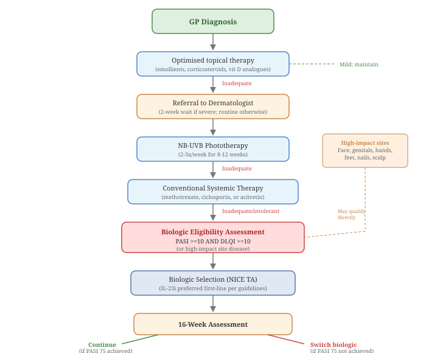

This section maps the typical journey of a psoriasis patient through the UK National Health Service, from first presentation to biologic therapy. If you're a UK patient navigating the system, understanding how NICE (National Institute for Health and Care Excellence) guidance shapes treatment access will help you know what to expect at each stage.

## 25.1 Primary Care (GP)

Most patients first present to their GP. Mild psoriasis (BSA < 10%) is managed entirely in primary care with topical therapies: emollients, topical corticosteroids (ranging from mild to potent depending on body site), vitamin D analogues (calcipotriol, calcitriol), and coal tar preparations. The GP will typically start with an emollient plus a moderate-potency steroid, stepping up as needed.

**Referral criteria.** NICE Clinical Guideline 153 [(NICE, 2017)](https://www.nice.org.uk/guidance/cg153) recommends referral to a dermatologist when: the diagnosis is uncertain; the disease is moderate-to-severe or affecting high-impact sites (face, hands, feet, genitals, scalp); topical therapy has failed after an adequate trial; there is significant impact on quality of life (DLQI ≥ 10); psoriatic arthritis is suspected; or the patient is a child with widespread or treatment-resistant disease.

## 25.2 Secondary Care (Hospital Dermatology)

On referral, a consultant dermatologist will confirm the diagnosis, assess severity using PASI and DLQI scores, screen for comorbidities (psoriatic arthritis, metabolic syndrome, depression), and put together a treatment plan.

**Step 1: Optimised topical therapy.** The dermatologist may optimise topical treatment with combination products (calcipotriol/betamethasone dipropionate), stronger corticosteroids, or dithranol (anthralin).

**Step 2: Phototherapy.** NB-UVB phototherapy is the next step. It typically involves attending hospital 2-3 times per week for 8-12 weeks. PUVA (psoralen + UVA light) is used less commonly due to long-term skin cancer risk.

**Step 3: Conventional systemics.** If phototherapy is impractical, insufficient, or not tolerated, conventional systemic therapy is initiated. The standard first-line systemic is **methotrexate** (typically 15-25 mg once weekly with folic acid supplementation). Alternatives include **ciclosporin** (particularly for rapid control or in women of childbearing age), **acitretin** (particularly for palmoplantar or pustular disease), and **dimethyl fumarate**. All of these require regular blood monitoring (FBC, LFTs, renal function).

## 25.3 Biologic Eligibility

Biologic therapy is funded by the NHS under NICE Technology Appraisal guidance. The standard eligibility criteria are:

- **PASI ≥ 10** AND **DLQI ≥ 10** (i.e., at least moderate-to-severe disease with significant quality-of-life impact)
- The patient has **failed, is intolerant of, or has contraindications to at least two standard systemic therapies** (typically methotrexate and ciclosporin), or has failed one systemic therapy plus phototherapy

For **high-impact site psoriasis** (severe disease at localised sites causing significant functional impairment or distress, e.g., palmoplantar, genital, facial, or nail disease), the PASI criterion may not apply. BAD guidelines define this as a distinct pathway with local commissioning arrangements, typically requiring a PGA of moderate-to-severe and DLQI ≥ 10.

## 25.4 Choosing a Biologic

Once eligible, the choice of biologic follows both clinical and cost-effectiveness considerations, guided by the BAD biologic therapy guidelines [(Smith et al., 2020)](https://pubmed.ncbi.nlm.nih.gov/32189327/) and their 2023 pragmatic update [(Smith et al., 2024)](https://pubmed.ncbi.nlm.nih.gov/37740557/). As of 2024-2025, the NHS treatment algorithm is broadly:

**First-line biologic:** Adalimumab biosimilar is currently the best-value biologic (BVB) in most NHS regions because biosimilar competition has driven costs down. Clinical factors may direct the choice elsewhere, though. Certolizumab for pregnancy planning, IL-17 inhibitors for coexisting psoriatic arthritis with axial disease, and so on.

**Assessment of response.** Treatment response is measured at 16 weeks. NICE defines an adequate response as PASI 75 (75% improvement) or a PASI reduction of ≥ 50% plus a DLQI reduction of ≥ 5 points. If you don't meet this threshold, the biologic is stopped and you're switched to another.

**Switching.** Most NHS regions fund up to 3 sequential biologics, with a fourth permitted if the switch involves changing mechanism of action (e.g., moving from a TNF inhibitor to an IL-23 inhibitor). You don't need to "deteriorate back" to a PASI of 10 to be eligible for switching if you're demonstrably failing current therapy.

**NICE-approved biologics for plaque psoriasis** (as of early 2026) include: adalimumab (TA146), etanercept (TA103), infliximab (TA134), ustekinumab (TA180), secukinumab (TA350), ixekizumab (TA442), brodalumab (TA511), guselkumab (TA521), tildrakizumab (TA575), risankizumab (TA596), bimekizumab (TA723), certolizumab pegol, and the oral small molecules apremilast (TA419), dimethyl fumarate (TA475), and deucravacitinib (TA907).

## 25.5 Pre-Biologic Screening

Before starting any biologic, you'll go through a standardised screening process. This isn't bureaucracy — biologics modify your immune system, and certain latent infections can reactivate under immunosuppression. Knowing what to expect makes the process less daunting.

**Standard screening blood tests:**

- Full blood count (FBC), liver function tests (LFTs), renal function (U&Es, eGFR), and CRP. These establish your baseline and flag any contraindications (e.g., hepatic impairment for methotrexate, renal impairment for dose adjustment).
- Lipid profile and HbA1c, particularly given the metabolic comorbidity burden (Section 14.3).

**Infection screening:**

- **Tuberculosis (TB)**: Either a Mantoux test (tuberculin skin test) or an interferon-gamma release assay (IGRA, e.g., QuantiFERON-TB Gold). Latent TB can reactivate on biologic therapy, particularly TNF-α inhibitors. If the test is positive, you'll need treatment for latent TB (typically 3–6 months of isoniazid or rifampicin) before or alongside biologic initiation. A chest X-ray is also standard.
- **Hepatitis B and C serology**: Hepatitis B surface antigen (HBsAg), anti-HBs, anti-HBc, and hepatitis C antibody. Hepatitis B reactivation on biologics can be life-threatening. If you're not immune, hepatitis B vaccination is recommended before starting treatment (Section 30.4). Chronic hepatitis B carriers may need antiviral prophylaxis during biologic therapy.
- **HIV testing**: Offered as part of screening in many centres, particularly if risk factors are present.

**Other assessments:**

- **Varicella (chickenpox) immunity**: If you've never had chickenpox and aren't immune, varicella vaccination should be completed before starting biologics (it's a live vaccine and can't be given during biologic therapy).
- **Vaccination catch-up**: Ideally, all recommended vaccines should be completed before biologic initiation (Section 30.4). This is particularly important for Shingrix (herpes zoster), pneumococcal, and influenza vaccines.
- **Pregnancy test** for women of childbearing potential, and a contraception plan if required by the specific drug.
- **PsA screening**: If not already done, screening for psoriatic arthritis (Section 15.5) using a validated tool like PEST, since the choice of biologic may differ depending on whether joints are involved.

The whole screening process typically takes 2–4 weeks, including blood results and any required vaccinations. Some centres run a dedicated pre-biologic clinic or nurse-led screening pathway to streamline this.

## 25.6 Ongoing Monitoring

All patients on biologic therapy are enrolled in BADBIR (British Association of Dermatologists Biologics and Immunomodulators Register), a national prospective registry that tracks long-term safety outcomes [(Burden et al., 2012)](https://pubmed.ncbi.nlm.nih.gov/22356636/). You'll typically be reviewed every 3 months in the first year and every 6 months thereafter if stable, with blood monitoring as required by the specific drug.

## 25.7 Devolved Nations: Scotland, Wales, and Northern Ireland

The pathway described above applies to England. Scotland, Wales, and Northern Ireland have their own health technology assessment bodies and may differ in drug availability, eligibility criteria, and prescribing freedom.

**Scotland.** The Scottish Medicines Consortium (SMC) appraises new medicines for NHS Scotland. SMC appraisals generally align with NICE but can diverge on timing and conditions. Prescriptions are free in Scotland (no prescription charge), removing one financial barrier to treatment adherence.

**Wales.** The All Wales Medicines Strategy Group (AWMSG) provides advice to Welsh Government on new medicines not appraised by NICE. Where NICE technology appraisals exist, Wales typically follows them. Prescriptions are free in Wales.

**Northern Ireland.** Northern Ireland generally follows NICE guidance, but implementation timelines can differ. Prescriptions are free in Northern Ireland.

The practical consequence: patients in different UK nations may have slightly different access to specific biologics or face different waiting times for treatment. The BAD guidelines apply across the UK, but commissioning decisions are made locally. If you're unsure about access in your region, your dermatologist or specialist pharmacist can advise on what's available through your local formulary.

## 25.8 Getting the Most from Your Appointments

Dermatology consultations are often short — 10 to 15 minutes in many NHS settings. Making that time count requires preparation. Here are questions worth asking at key decision points:

**When starting a new treatment:**

- What improvement should I expect, and how long before I see it?
- What are the most common side effects, and which ones should prompt me to call?
- Is this a short-term or long-term treatment? What happens when I stop?
- How does this interact with anything else I'm taking (including over-the-counter products)?

**When a treatment isn't working:**

- How do we define "not working" — are we using PASI, DLQI, or something else?
- Is the issue efficacy, side effects, or adherence? (Be honest about the last one — Section 20.8.)
- Should we escalate the dose, switch drugs, or add something alongside?
- Am I eligible for a biologic, and if not, what would change that?

**When choosing between biologics:**

- What are the differences between the options in terms of how well they work, how often I inject, and side effects?
- Does one option cover both my skin and my joints (if PsA is present)?
- What happens if this one stops working — what's the next step?
- How quickly will I get the first dose once we decide?

You don't need to memorise these. Bring a written list. Your dermatologist would rather you asked too many questions than too few. The Patient Benefit Index (Section 10.3) can help you articulate what matters most to you — whether that's itch reduction, hand clearance, or being able to wear short sleeves — so the treatment plan reflects your priorities, not just your PASI score.
